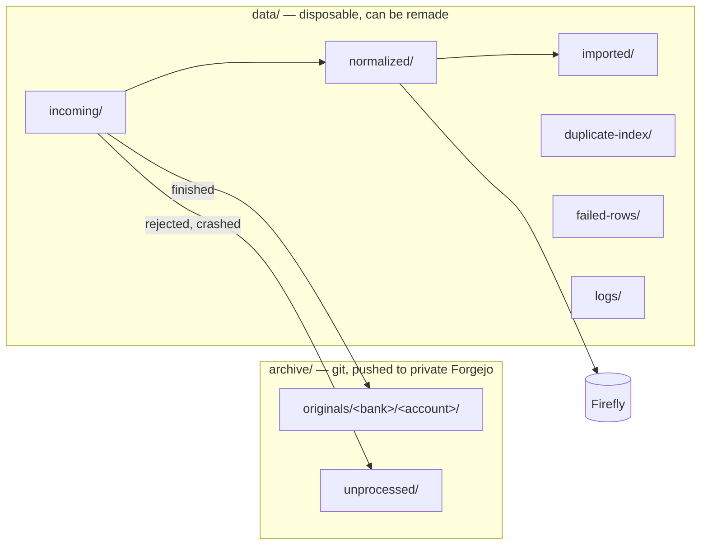
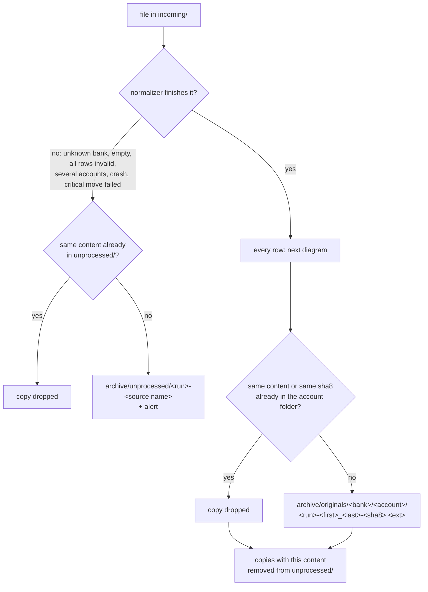
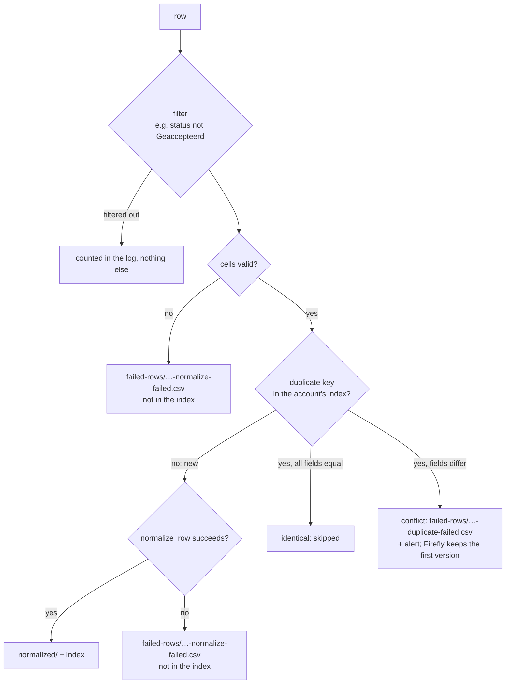
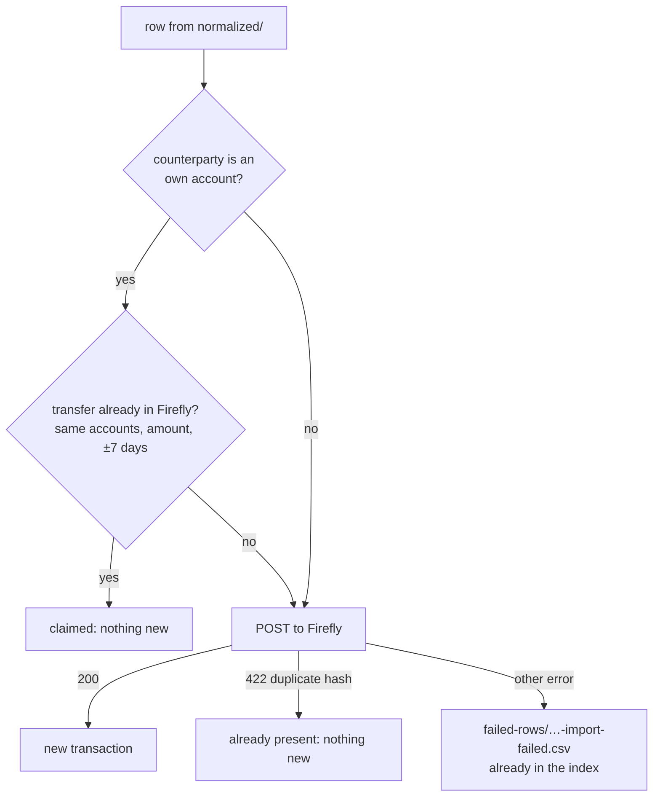
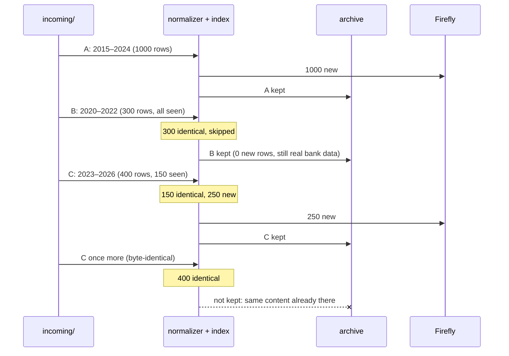
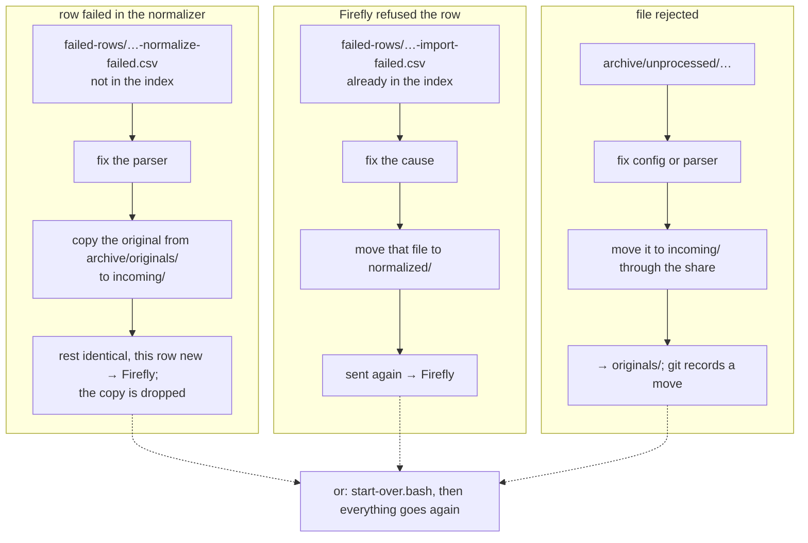
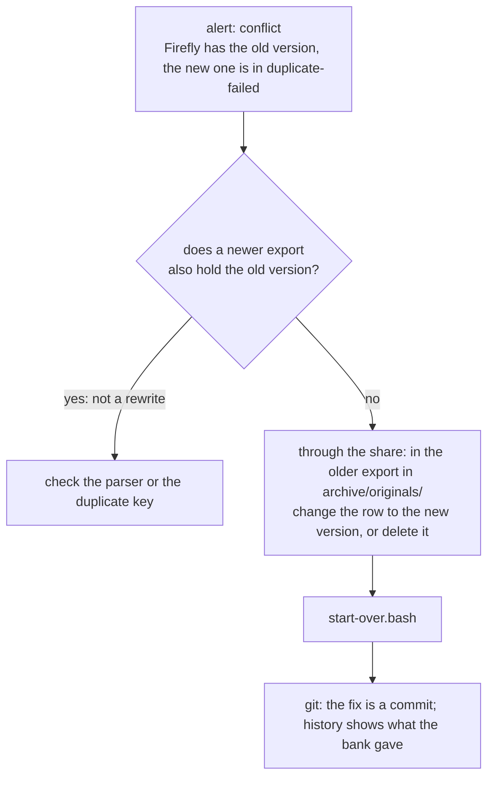
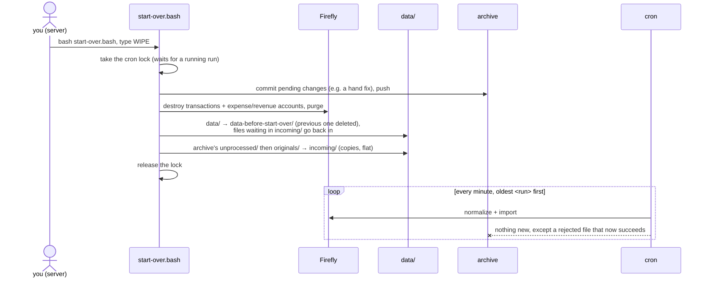

# Archive and starting over

Every export dropped in `data/incoming/` is kept in a private git repo on the server, and
`start-over.bash` wipes the transactions in Firefly and loads that archive again (AGENTS.md,
hard rule "Rebuild from scratch"). Examples are made up.

## The archive

`archive/` in the feeder folder is its own git repo, with `origin` a private repo `finance-data` on
Forgejo. It is kept out of this public repo (`.gitignore`) and out of the SFTP watcher (`ignore`).

```
archive/
  originals/<bank>/<account>/<run>-<first>_<last>-<sha8>.<ext>   finished by the normalizer
  unprocessed/<run>-<source name>                                not finished
  .gitignore                                                     Thumbs.db, desktop.ini, ~$* (Office lock files)
```

- `<account>`: the `partition_by` value, else the bank name (as in `row_key`).
- `<run>`: the run id of the file's arrival (below); `<first>_<last>` as in the `data/` names, left
  out when unknown.
- `<sha8>`: the first 8 hex digits of the SHA-256 of the export as it arrived.

### Rules, and why

1. **Git runs on TrueNAS itself** (a host binary, survives updates): the exports arrive there, so
   nothing travels to the desktop and back.
2. **Everything dropped in `incoming/` is archived**, also what the feeder cannot process: a
   rejected export may hold bank data the bank no longer provides later.
   - `originals/`: the normalizer finished the file (`success`, `partial`, `all_failed`,
     `all_full_duplicates`, `all_filtered`), however many rows succeeded. An `all_filtered` file
     takes account and period from its filtered rows.
   - `unprocessed/`: rejected (unknown bank, empty, every row invalid, several accounts, account
     unknown), crashed (exit 99, 1 or an unknown code), or a critical file operation failed
     (92–97). The reason is in the alert and the log, not in the name.
3. **A file keeps the run id of its arrival.** A name that already starts with a run id (a copy
   from the archive) keeps it, so a reload processes the files in their original order and gives
   the same outcome. The names in `data/` take the current run id, which keeps them unique.
4. **Each export is archived once.** A file is deleted from `incoming/` instead ("already
   archived, copy dropped" in the log) when its target folder already holds the same content, or,
   in `originals/`, a name ending in its `-<sha8>.<ext>`: the same export, corrected by hand since.
   Once a file is finished, copies with its content are removed from `unprocessed/`.
5. **Overlapping exports are fine.** Each is archived; the duplicate index deduplicates their rows
   at every load.
6. **`data/` is disposable.** It holds no original; rows that failed are in `data/failed-rows/`.
7. **Git after every run with work.** After the importer, still under the lock,
   `firefly-iii-feeder.bash` runs `git add -A`, commits when anything changed (message
   `Run <run start>: 1 added, 1 moved, …`, one line per path) and pushes. So a hand fix made through
   the share is committed by the next run with work. Silent on success; git's output is shown only
   on failure, since the cron job mails any output.
   - Push fails (Forgejo unreachable): the commits stay local and `data/archive-push-pending.flag`
     makes every next minute push again (it counts as work in the idle test). One alert per outage.
   - `archive/.git` missing: alert "ARCHIVE NOT UNDER GIT" in every run with work; the files are
     still archived.
8. **`config/app.env` holds only what can be remade without git**: `FIREFLY_URL` and
   `FIREFLY_TOKEN` (a new token in Firefly). Everything else a reload needs belongs in the archive.
9. **One feeder at a time** (truenas-master only): the archive has one writer.
10. **The share writes as the cron user.** Files dropped through the share belong to the user the
    cron job runs as, so git and the feeder can move and commit each other's files. If the share
    ever logs in as another user, git refuses those files ("dubious ownership"): then
    `safe.directory` or group permissions.

## What happens to files and rows

### What stays, what is disposable



### One file



### One row in the normalizer



A row enters the index only once it is normalized, so a row that failed is retried as soon as the
same export arrives again.

### One row in the importer



### Overlapping exports

Three exports of one account, requested and dropped in this order:



Firefly: 1250 transactions; the archive: A, B and C.

### Retrying a row or a file



### Conflict: the bank rewrote a row

Same duplicate key, other fields: the first version stays in Firefly, the new one goes to
`duplicate-failed` with an alert. The fix is a hand edit in the archive, the only hand fix to input
there is: git keeps what the bank originally gave.



Not when a newer export also holds the "error" (Fintro's misprinted rate, Fintro README "Quirks"):
that export would cause the conflict again. The corrected export keeps its name, so the uncorrected
one dropped again is recognized by its `<sha8>` and not archived twice.

## `start-over.bash`

When to use it, and what to do first: AGENTS.md "Start Over". From the root shell on the server:

```bash
sudo -H -u <cron user> bash <app-ds>/firefly-iii-feeder/start-over.bash
```

Started with `bash`: git keeps it as `100644` and SFTP sets no execute bit.



1. Refuses to run as anyone but the owner of the feeder folder: a root-owned file in `data/` or
   `archive/` breaks the cron job.
2. Stops before asking when `app.env` lacks URL or token, `archive/` has no `.git`, or
   `originals/` is empty (a wipe with nothing to load back).
3. Pushes right after its commit, also with nothing to commit. A failed push only shows on screen
   and puts the push flag in the new `data/`, so cron retries silently; the commits are safe
   locally.
4. Repeats each `destroy` while Firefly answers `504` (it stops partway after about a minute) and
   stops on any code but `204`. The token goes to `curl` through stdin, not the process list.
5. Copies only what the archive repo holds: leftovers its `.gitignore` keeps out stay behind.
   `unprocessed/` goes first, so for a file in both under one name the `originals/` copy wins.
6. Every stop says what state it leaves: before the wipe nothing changed; after it, fix the cause
   and run it again.

Files waiting in `normalized/` are dropped: their originals are in the archive. A rejected file
that still fails alerts again and stays in `unprocessed/`. How long the reload takes: AGENTS.md "Start Over".

**Not restored** by a start-over:
- `config/app.env` (URL, token) and the one-time setup: Firefly's configuration, the root helper
  and its sudo rule, the cron job, the archive repo (below).
- Own (asset) accounts: they are not wiped, and not in the archive either; the importer needs them
  with their IBANs. A new Firefly needs them created by hand first.
- Classification: rules, categories and tags stay in Firefly but no longer hold any transaction.
- Anything entered by hand in Firefly: every transaction and every expense/revenue account is
  wiped, not only what the feeder created.
- A column the bank only recently added: older originals lack it, until a fresh history export.
- The previous `data/` (logs, failed rows) stays in `data-before-start-over/` until the next one.

## Setup (by hand, once per server)

Every command that writes in the feeder folder or the cron user's home runs as the cron user
(`sudo -H -u <cron user> …`; without `-H` git looks for its config in `/root`), so the key,
`archive/` and its `.git/` belong to that user.

1. Desktop: `archive` and `data-before-start-over` in the `ignore` of `.vscode/sftp.json`, first,
   so the watcher never touches them.
2. Forgejo: a private, empty repo `finance-data`.
3. A key for the cron user in its home on a data pool (it survives a TrueNAS update): key
   `id_ed25519_finance_data` and ssh config `finance-data.config` in its `.ssh/`, holding a `Host
   forgejo` with `IdentityFile`, `IdentitiesOnly yes`, `UserKnownHostsFile` in that same folder and
   `BatchMode yes` (cron never waits for a prompt). Its public key is a deploy key **with write
   access** to that repo only. One test connection records Forgejo's host key.
4. `git init -b main` in `archive/` (the server's git defaults to `master`), with in its
   `.git/config`: `core.sshCommand` = `ssh -F <that config>`, `user.name` / `user.email` of the
   private Forgejo identity, `origin` = `git@forgejo:<owner>/finance-data.git`. The cron user then
   needs no `~/.gitconfig`. Check with `git -C archive ls-remote origin`, as the cron user.
5. `archive/.gitignore`: `Thumbs.db`, `desktop.ini`, `~$*`. The first run with work commits it,
   and the first push creates `main` on Forgejo.

## Restore on a new server

1. Firefly III and its one-time setup (AGENTS.md "Firefly III Import", gotchas; "Root helper"),
   the own accounts with their IBANs, and the cron job.
2. The feeder code in its folder, owned by the cron user.
3. Setup steps 1–3 above; then, instead of `git init`, clone the archive and give the clone the
   same `.git/config` entries as step 4:

   ```bash
   git -c core.sshCommand='ssh -F <that config>' clone git@forgejo:<owner>/finance-data.git archive
   ```

4. `config/app.env` with `FIREFLY_URL` and a new `FIREFLY_TOKEN`, mode 600.
5. `start-over.bash`.

## Known limitations

- **Forgejo is not replicated to truenas-backup** (still to do in sync-truenas-servers): the
  archive and its Forgejo remote are on one machine, covered only by the hourly snapshots of
  `app-ds`.
- **Own accounts are not in the archive**: a new Firefly needs them created by hand before a
  reload.
- **`bank-csv-originals/`** still holds exports the feeder cannot read yet (Argenta: xlsx, pdf);
  they enter the archive once it can.

## Later

Once a finance app needs `finance-data` on TrueNAS too: a folder `finance-data/` next to the feeder
holds the clone, the archive moves into `finance-data/household/`, and `archive` becomes a symlink
to it. Samba does not follow a symlink out of its share (`wide links` off), so the share then needs
another route to that folder.
