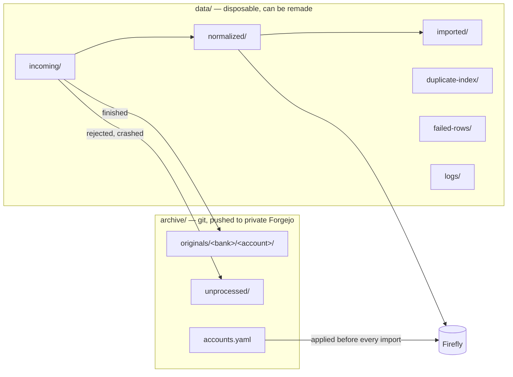
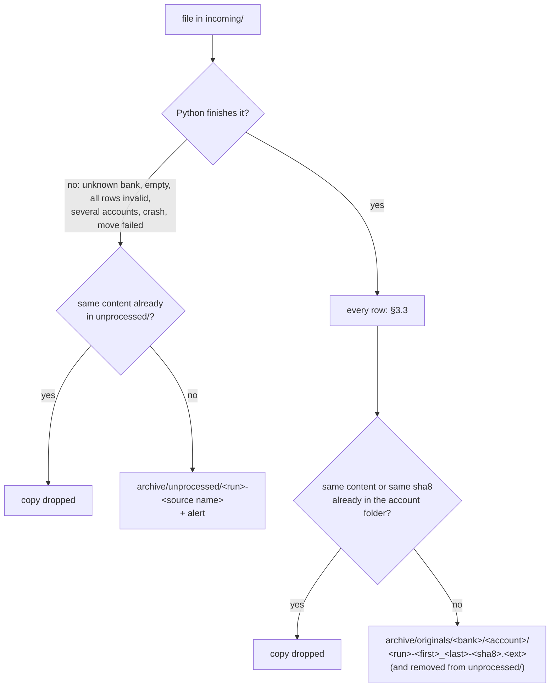
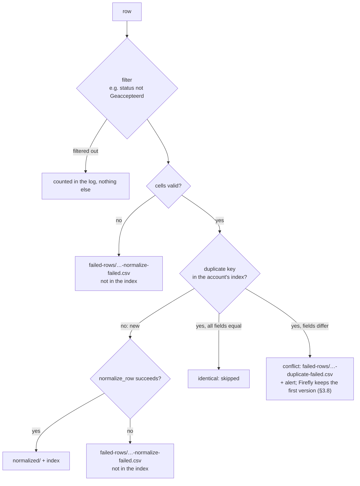
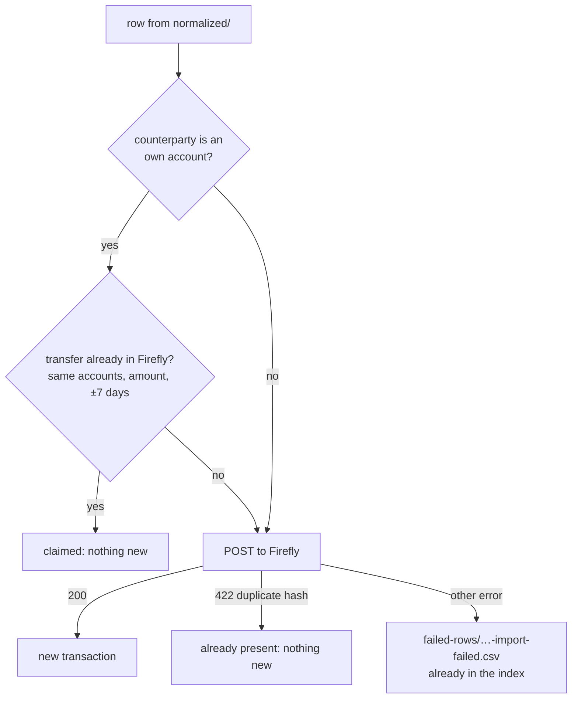
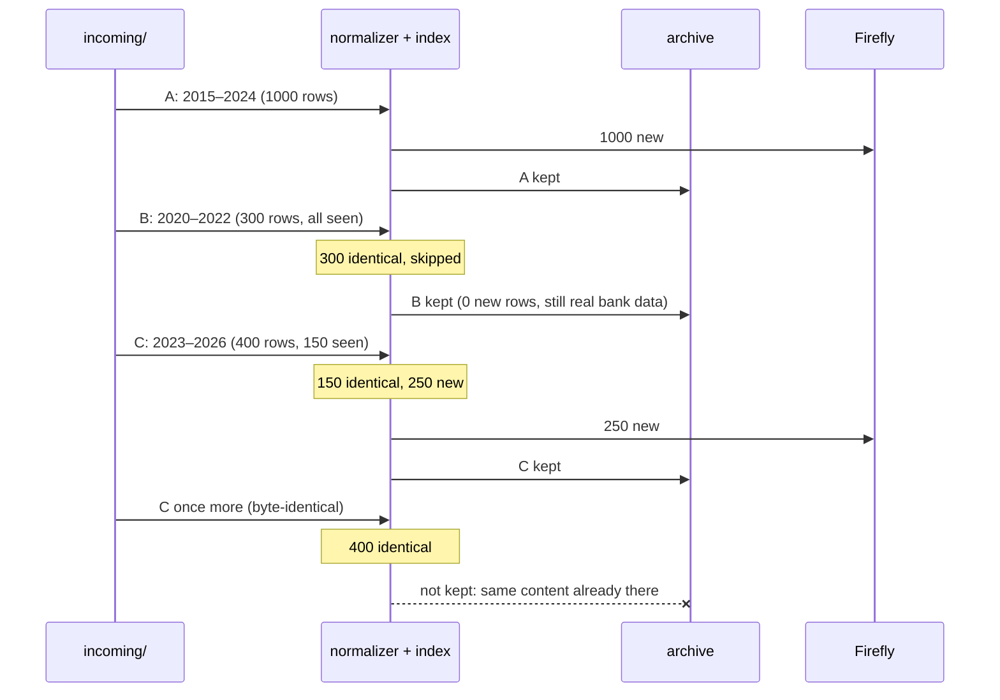
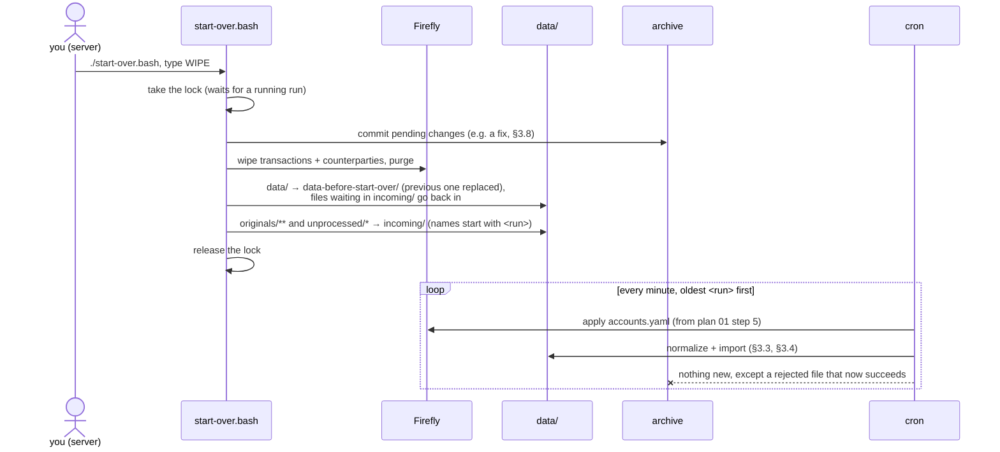
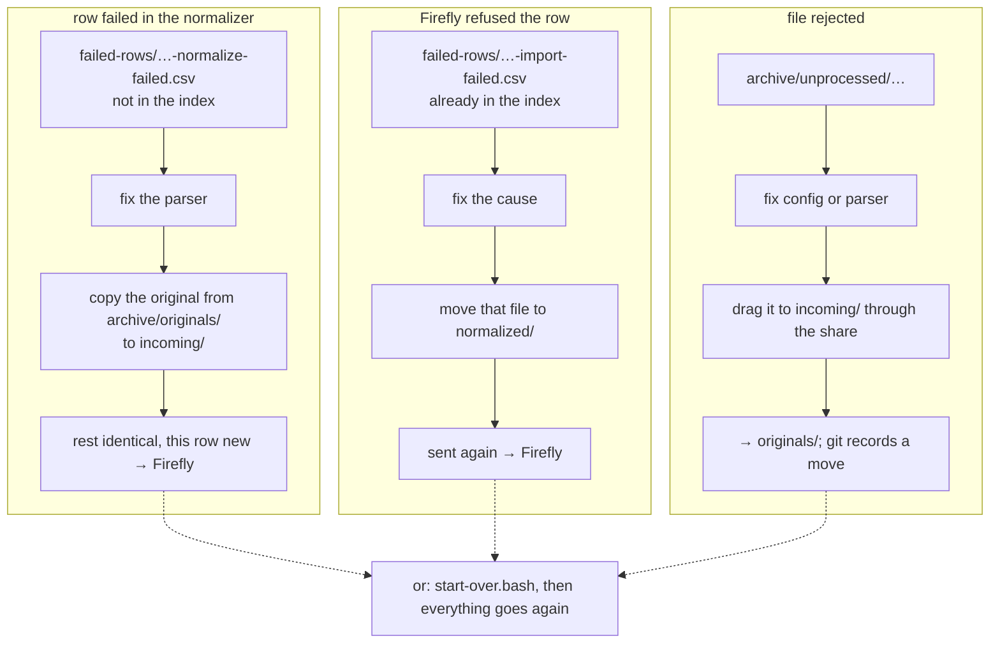
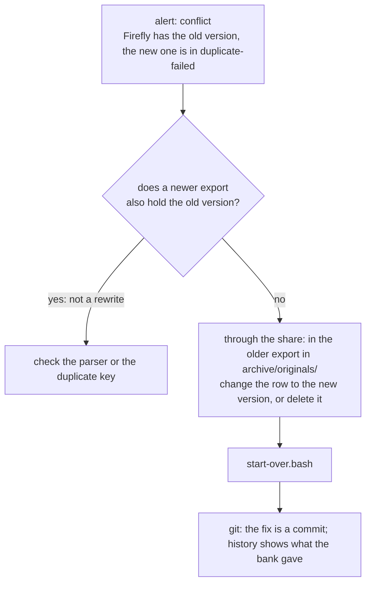

# Plan 00 — Archive and starting over

Status: **in progress — steps 1–3 done; next: step 4 (git in bash).** To be carried out
before [plan 01](01-core-fintro-firefly.md) step 4 (its steps 0–3 are done) and before
[plan 02](02-argenta.md). Examples are made up (public repo).

Goal: you drop an export in `data/incoming/` and need to do nothing else. Everything needed to
fill Firefly again from zero comes under version control in private Forgejo by itself, and
starting over is one command.

Hard requirement for every step: **an idle run stays free** (AGENTS.md "Idle cost"). Everything
below runs only when there is work; the only new idle test is a builtin `[[ -e ]]` (step 4).

## 1. Requirement

Becomes a hard rule in AGENTS.md (step 1):

> What the feeder puts into Firefly (own accounts and transactions) is derived from the input.
> Wiping it and loading it again must always be possible, with one command, and gives the result
> of the current code. After every structural change to the feeder or to Firefly, that is the
> normal way to give old transactions the new shape.

1. All input is in the archive repo; `data/` and the feeder's part of Firefly contain nothing
   that cannot be remade.
2. Fix nothing by hand in `data/` or in Firefly. A fix goes into the parser, the config or the
   accounts file; the only hand fix to input is one in the archive itself (§3.8).
3. Classification is outside the scope: a wipe keeps rules, categories and tags in Firefly but
   removes them from the transactions. Reapplying them is a requirement for the finance tool,
   once it is built.

## 2. Decisions

1. ✅ **Archive repo on the server**: folder `archive/` in the feeder folder, its own git repo,
   remote a private repo `finance-data` on Forgejo (later all personal finance data, not only
   the feeder's; §7). Git runs on TrueNAS itself (a
   host binary, survives updates): the exports arrive there, so nothing travels back and forth to
   the desktop. Not in the public repo (`.gitignore`), not in the SFTP watcher (`ignore`).
2. ✅ **Everything dropped in `incoming/` ends up in the archive**, also what the feeder cannot
   process: a rejected export may be real bank data the bank no longer provides later.
   ```
   archive/
     originals/<bank>/<account>/<run>-<first>_<last>-<sha8>.<ext>   processed
     unprocessed/<run>-<source name>                                not (yet) processed
     accounts.yaml                                                  own accounts (plan 01 step 5)
   ```
   - `originals/`: Python finished the file (success, partial, all_failed, all_full_duplicates,
     all_filtered), however many rows succeeded.
   - `unprocessed/`: rejected (unknown bank, empty, all rows invalid, several accounts), crashed
     (exit 99, or bash exit 1/unknown), or a critical move failed (92–97). The reason is in the
     alert and the log, not in the name.
3. ✅ **`<run>` = when the file arrived**, and it stays that: a file whose name already starts with
   a run id (a copy from the archive) keeps that run id. A reload puts the files back in that
   order, so with the same outcome.
4. ✅ **`<sha8>`** = start of the SHA-256 of the export as it arrived. A file is not archived again
   when its account folder already holds a file with the same content, or with the same `<sha8>`
   in its name (the same export, since corrected by hand, §3.8). A file that lands in
   `originals/` is removed from `unprocessed/` if it was there too.
5. ✅ **Overlap is no problem.** You request exports per period yourself; overlapping rows are
   then in the archive more than once, and the duplicate index deduplicates them at every
   (re)load.
6. ✅ **`data/processed/` goes away**, **`data/failed/` becomes `data/failed-rows/`** and holds
   only rows (`-normalize-failed`, `-duplicate-failed`, `-import-failed`). Everything in `data/`
   is then disposable.
7. ✅ **Git after every run with work**: `git add -A`, commit, push. If the push fails (Forgejo
   unreachable), the commit stays local and `data/archive-push-pending.flag` makes every next
   minute push again; one alert per outage.
8. ✅ **Conflict = a hand fix in the archive.** When the bank rewrote a row (same key, other
   fields), the first version wins and the new one fails with an alert (as now). Fix: in the
   **older** export in `archive/originals/`, change the row to the new version or delete it, then
   `start-over.bash`. Git keeps what the bank originally gave. Not when a newer export also holds
   the "error" (Fintro's misprinted rate, Fintro README "Quirks"): that export would then cause
   the conflict.
9. ✅ **`start-over.bash` does not block** on rejected files: they are in the archive and go back
   in with the rest. A row problem can be solved long after a reload.
10. ✅ **What is only in `config/app.env` must be recreatable without git**: `FIREFLY_URL` and
    `FIREFLY_TOKEN` (create a new token in Firefly). Everything else a reload needs belongs in the
    archive; hence plan 02's `ARGENTA_MASTERCARD_PAID_FROM_IBAN` moves into `accounts.yaml`.
11. ✅ **`bank-csv-originals/` goes away** once everything in it is in the archive: Fintro at step 6
    below, Argenta at the reload of plan 02 §4. Also for testing: the regression test then reads
    the archive, with the same overlap cases.
12. ✅ **One feeder at a time** (truenas-master only); the archive has one writer.

## 3. What happens to files and rows

### 3.1 What stays, what is disposable



### 3.2 One file



### 3.3 One row in the normalizer (unchanged)



A row enters the index only once it is normalized; a row that failed is retried as soon as the
same export arrives again (§3.7).

### 3.4 One row in the importer (unchanged)



### 3.5 Overlapping exports

Made up: three exports of one account, requested and dropped in this order.



Firefly: 1250 transactions; the archive: A, B and C.

### 3.6 Starting over



Files in `normalized/` are dropped: their original is in the archive. A rejected file that still
fails alerts again and stays in `unprocessed/`.

### 3.7 Retrying a row or a file



### 3.8 Conflict: the bank rewrote a row



## 4. Steps (order = commits)

**How each step is run** — in a fresh session, one step per session:
1. Read AGENTS.md (hard rules, "Deploy = save", "Server access") and this plan: §2, §3, the
   step, §5. Read the code the step touches before changing it.
2. `git status` and `git log --oneline -5` first: other sessions commit to this repo too.
3. Server access is read-only (AGENTS.md "Server access"); commands that write are handed to the
   user, as the cron user. The share path from the desktop is `//<server>/firefly-iii-feeder/`.
4. Before saving code that runs on the server (steps 3–5): check read-only that
   `data/incoming/` and `data/normalized/` are empty and no `data/*.flag` is pending, then save
   all files of the step in quick succession.
5. Test as in §5 for that step; `pre-commit run --all-files`; regression test (zero differences:
   nothing here changes a row). Real bank files used in a throwaway copy are deleted afterwards.
6. Mark the step ✅ with its commit in this plan and update the status line; commit and push
   only after the user's OK.

### Step 1 — Requirement in AGENTS.md ✅ `759ea61`

The hard rule of §1 in AGENTS.md ("Rebuild from scratch"), with "Start Over" and the
duplicate-hash gotcha pointing to it, and a section "Server access". The rest of AGENTS.md
describes current behaviour and follows in step 7.

### Step 2 — Setup by hand (you, on the server) ✅

No code; the only commit is marking the step done. Claude gives the exact commands, one block per
item, and checks each result read-only (AGENTS.md "Server access"); you paste them in your root
shell on the server. Every command that writes in the feeder folder or the cron user's home runs
as that user (`sudo -H -u <cron user> …`), so the key, `archive/` and its `.git/` belong to the cron
user, not to root.
1. Locally (Claude, on the desktop): `archive` and `data-before-start-over` in the `ignore` of
   `.vscode/sftp.json` — first, so the watcher never touches them.
2. Forgejo (you, in its web UI): create the private repo `finance-data`, empty.
3. A key for the cron user in its second home dir (`homedir-ds`, survives a TrueNAS update), with
   an ssh config holding the `forgejo` alias (`IdentityFile`, `IdentitiesOnly yes`,
   `UserKnownHostsFile` in that same folder, `BatchMode yes`, so cron never waits for a prompt);
   its public key as a deploy key **with write access** to that repo only. One test connection
   to put Forgejo's host key in that `known_hosts`.
4. `git init` in `archive/` (created here), with in `.git/config`: `core.sshCommand` =
   `ssh -F <that config>`, `user.name`/`user.email` of the private Forgejo identity, `origin` =
   `git@forgejo:<owner>/finance-data.git`. Check with a read-only
   `git -C archive ls-remote origin` run as the cron user.

As built: key `id_ed25519_finance_data` and config `finance-data.config` in the cron user's
`.ssh/`; `git init -b main` (the server's git defaults to `master`). With `sudo -u`, add `-H`, or git
looks for its config in `/root`.

### Step 3 — Archive in the normalizer ✅

Prerequisite: step 2 done (`archive/` exists under git; `archive` in the SFTP `ignore`).

1. `finalize` (block 2, "original CSV move"): finished → `archive/originals/…`, else →
   `archive/unprocessed/…`, with the checks of §2.4 (`hashlib`). Details:
   - Account folder = the `partition_by` value, else the bank name (as `row_key`). Period: as in
     the `data/` names (`describe_output`).
   - `all_filtered` stops today before the account is known. Determine the account from the rows
     before filtering (e.g. `validate_and_prepare` also returns the `partition_by` values of the
     filtered rows); only if it is still unknown → `unprocessed/` with an alert.
   - "Same content" = equal SHA-256 of the whole file, compared with every file in the target
     folder (few files per account); "same `<sha8>`" = the name ends in `-<sha8>.<ext>`.
   - A file dropped because it is already archived is deleted from `incoming/`.
   - Compensating moves (exit 92, 93, 94): the original goes to `archive/unprocessed/`; if it was
     dropped as already archived, there is nothing to move. Exit 94 now means "original not
     archived".
2. `build_paths` / `output_paths`: no `processed_*` any more; `failed_dir` → `failed-rows`.
3. Run id of arrival (§2.3): a source name matching `^[0-9]{8}-[0-9]{6}-[0-9]{3}-` keeps that
   prefix as the archive run id, and for `unprocessed/` the name stays as it is (no second
   prefix). `describe_output` still uses the new run id for `data/` (unique per run).
4. Bash: the fallback moves (exit 1, 92–97, unknown) → `archive/unprocessed/`, named
   `<RUN_ID>-<name>`, or `<name>` when it already starts with a run id (`[[ =~ ]]`, builtin); an
   existing file of that name is overwritten (same export). `FAILED_DIR` → `data/failed-rows`;
   `mkdir -p` also for `archive/originals` and `archive/unprocessed`.
5. Importer: `-import-failed.csv` to `data/failed-rows/`, and the paths in its alert texts.
6. `.gitignore`: `archive/` and `data-before-start-over/`.
7. On the server, the existing `data/processed/` and `data/failed/` are left as they are: nothing
   reads them any more, and the first `start-over.bash` moves them aside with the rest of `data/`.
   Their originals are in `bank-csv-originals/` and come into the archive at step 6.

As built, with choices not stated above:
- `all_filtered`: account and period come from the filtered rows through the `column_map`
  `validate_and_prepare` already returns (its signature is unchanged); an account that fails its
  column's `regex` counts as unknown → `unprocessed/`, exit 65.
- Removing a finished original's copies from `unprocessed/` is a separate step 5 of `finalize`,
  after the critical steps and not critical itself; it also runs when the original was dropped as
  already archived. Steps 5–7 became 6–8.
- Bash no longer moves anything into `data/`, so `FAILED_DIR` is gone instead of renamed, and bash
  creates only `archive/unprocessed/` (Python creates the account folders).
- The alert names where the original went (`Original: …`, also in the log).
- `run_log` wrote to a new `<run>.log` once Python had renamed the log; it now finds the renamed one.

Tested in a copy (13 runs): new export, same content under another name, overlapping export,
unknown file twice, crash (exit 1), unknown exit code on a name with a run id, a copy from
`originals/`, a rejected file that succeeds after the fix (arrival run id kept, removed from
`unprocessed/`), the uncorrected export after a hand fix, only pending rows with a valid and an
invalid account, exit 94 and exit 97. Regression 0 differences on 14,080 rows; idle on the server
1.97 ms.

### Step 4 — Git in bash

1. After the importer, still under the lock, only in a run with work: if `archive/.git` exists,
   `git -C archive add -A`, a commit when something changed (message: the added, moved and changed
   paths), then `git push`. Silent on success (`-q`, no output on stdout or stderr: the cron job
   mails any output); on failure the git output goes to stderr.
2. Push fails → `data/archive-push-pending.flag`, alert only when the flag is new. The idle test
   gets `|| [[ -e "${ARCHIVE_PUSH_FLAG}" ]]` (builtin); a run with only that flag just pushes.
   Push succeeded → flag removed.
3. `archive/.git` missing → alert in every run with work ("archive not under git": step 2 is
   missing); the files still go into `archive/`.
4. Measure idle again on the server, ≤ 2 ms (AGENTS.md "Idle cost"; a read-only command).

### Step 5 — `start-over.bash`

In the feeder folder, no arguments, as the cron user. Git keeps scripts as `100644` and SFTP does
not set the execute bit, so it is started with `bash`: from the root shell
`sudo -H -u <cron user> bash <app-ds>/firefly-iii-feeder/start-over.bash`; the script `cd`s to its
own folder, like `firefly-iii-feeder.bash`. Not run on the server in this step: its first real
run is the reload of plan 02 §4. Order as in §3.6:
1. Refuses to run as anyone but the owner of the feeder folder (so not as root), before touching
   anything: root-owned files in `data/` or `archive/` would break the cron.
2. `flock` on `.process.lock`, waiting, so a running run finishes first.
3. Shows the number of files in `originals/` and `unprocessed/`, asks for `WIPE`.
4. Commits pending changes in the archive ("before start-over").
5. Wipes and purges Firefly with the loops of AGENTS.md "Start Over", but stops (with a message)
   on any code other than `504` and `204` instead of repeating forever.
6. `data/` → `data-before-start-over/` (the previous one is removed); files waiting in
   `data/incoming/` go back into the new `data/incoming/`.
7. `archive/originals/**` and `archive/unprocessed/*` → `data/incoming/` (copies, flat folder).
8. Releases the lock and says: cron does the rest (~1 hour), alerts by mail.

### Step 6 — Fintro into the archive (you, on the server)

After steps 3 and 4 are live: Claude gives the command, you run it as the cron user —
`bank-csv-originals/Fintro/*.csv` once into `data/incoming/`. All rows are already known, so
nothing goes to Firefly; the 16 files (all distinct, checked) go into `originals/` and into
Forgejo. Then check `git -C archive log --stat` (read-only) and the repo in Forgejo. Bash ignores
Argenta's xlsx and pdf until plan 02 step 1, so those stay in `bank-csv-originals/` until the
reload of plan 02 §4. The only commit is marking the step done.

### Step 7 — Documentation

- **AGENTS.md**: "Idle cost" (the push flag also counts as work); "Key Directories" (`archive/`,
  `failed-rows/`, no `processed/`, no `bank-csv-originals/`); file names; "Lint" and "Firefly III
  Import" (paths in `failed-rows/`, retrying as in §3.7); "Start Over" becomes `start-over.bash`:
  what it does, when, and what it does not restore (token, one-time setup); conflicts as in §3.8;
  the setup of step 2 (moves to the checklist of plan 01 step 6 later); "Restore on a new server"
  (Firefly + checklist, feeder code, `git clone` of the archive into `archive/`, `app.env`,
  `start-over.bash`); exit 94; the hard rule "Rebuild from scratch" without "being built".
- **architectural_patterns.md**: §2 and §8 (original → archive, exit 94), §10 (archive names, run id
  of arrival), §11 (bash fallback → `unprocessed/`, git after the run, push flag in the idle test),
  §13 (`failed-rows/`).
- **README.md**: overview, project structure, "VS Code SFTP Sync" (`archive/` in `ignore`).
- **Fintro README**: "Export" (originals in the archive).
- Regression command: see plan 01 step 4.

## 5. Testing

1. Steps 3 and 4 — desktop, throwaway copy (AGENTS.md, testing a change to
   `firefly-iii-feeder.bash`), with an `archive/` holding an empty git repo and a local bare repo
   as `origin` (for step 3: an `archive/` without `.git/`): a Fintro export, the same once more, an
   overlapping one, an unknown file, a simulated crash; check what is in `originals/`,
   `unprocessed/` and the commits. Push to an unreachable remote → one alert, flag, the next run
   pushes.
2. Step 5: `start-over.bash` in the same copy, with a `config/app.env` whose `FIREFLY_URL` points
   to a local stub (a few lines of `python3 http.server` that answer `DELETE` with `504` once,
   then `204`; and one run with `401`, which must stop the script). Check: refused as another
   user than the folder's owner (on the desktop by temporarily expecting another owner); order
   in `incoming/`; run ids in the archive names unchanged; nothing twice in the archive; an
   original corrected by hand stays one file.
3. Step 6 on the server, then check `git -C archive log` and the repo in Forgejo.
4. The real reload with `start-over.bash` is the one of plan 02 §4.
5. Before every commit: scan the staged diff for IBAN-shaped strings and real names (public repo).

## 6. Consequences for the other plans

- **Plan 01**: §1.6 and step 5 — the accounts file is `archive/accounts.yaml`, edited through the
  share, applied as soon as it changes (idle test `-nt`, builtin); the SFTP route is dropped.
  Step 4 — the regression test reads `archive/originals/**`. Step 6 — the setup of step 2 in the
  checklist.
- **Plan 02**: §1.2 — the card's paying account in `accounts.yaml`, not in `app.env`. Step 1 — an
  xlsx or pdf the feeder cannot read yet goes to `unprocessed/`. §4 — the reload is
  `start-over.bash`, and fills the archive with Argenta; after that `bank-csv-originals/` goes away.
- **Finance repo** (private): the accounts file is no longer there but in the archive. Its
  classification tool, once built, must be able to reapply its work after a reload (§1.3).

## 7. Open

- Forgejo is not yet in the replication to truenas-backup (todo in sync-truenas-servers): until
  then archive and Forgejo are on one machine, with the hourly snapshots of `app-ds`.
- At execution: does the share write into `archive/` as the cron user? If not, `safe.directory`
  or group permissions, so git and the feeder can read and move each other's files.
- Once a finance app needs `finance-data` on TrueNAS too: a folder `finance-data/` next to the
  feeder holds the clone, the archive moves into `finance-data/household/`, and `archive` becomes
  a symlink to it. Samba does not follow a symlink out of its share (`wide links` off), so the
  share then needs another route to that folder.
