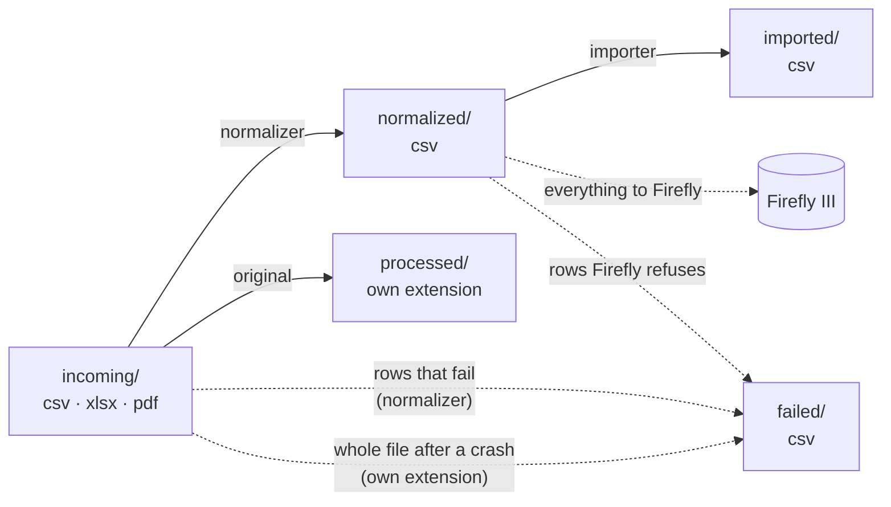

# Plan 02 — Argenta

Status: **approved; to be carried out after [plan 01](01-core-fintro-firefly.md)**, which
delivers the file names, `interest_date`, foreign currency, the lookup of own accounts and the
accounts file. Examples are made up (public repo); real rows stay in the terminal.

Hard requirement for every step: **an idle run stays free** (AGENTS.md "Idle cost").

## 0. What comes in

| Source | Format | Rows now | Notable |
|---|---|---|---|
| Current account | `.xlsx`, 1 sheet `Verrichtingen`, 11 columns | 250 | 16 kinds of `Beschrijving` |
| Savings account | same `.xlsx` format | 61 | interest with its own IBAN as counterparty |
| Mastercard | monthly **PDF statement**, 110 pieces | ± 430 lines (rough count) | no reference per line, no year per line |

Columns of the xlsx: `Rekening, Boekdatum, Valutadatum, Referentie, Beschrijving, Bedrag, Munt,
Verrichtingsdatum, Rekening tegenpartij, Naam tegenpartij, Mededeling`.

Established in the data:

1. **Dates are Excel numbers** (`45000` = 2023-03-15), amounts are **floats** (`-12.5`, `3.1`;
   made up).
2. **`Referentie` is not unique**: an expired term deposit gives two rows with the same
   reference (principal back + interest). Otherwise unique within an account; a transfer between
   the two Argenta accounts carries the same reference on both sides.
3. `Referentie` encodes the booking date: `C6I30…` = 202**6**, month **I** (A=Jan … L=Dec), day
   **30**. Holds for all 311 rows.
4. Card payments/withdrawals (Maestro, Bancontact abroad) have the **dummy `BE54 0000 0000 0000`**
   as counterparty IBAN — with a valid checksum (calculated), so Firefly would accept it and put
   all shops on one opposing account.
5. Interest (`Taks Portkost Interest`) has the **own account** as counterparty IBAN.
6. Term deposit: `Rekening tegenpartij` holds the **deposit number**, not an IBAN.
7. Card settlement `Debet ten voordele van BCC` (current account → Mastercard): name
   `MASTERCARD  247`; 247 = day number of the statement date (4 September; in a leap year 248).
   A few old rows: name empty.
8. The Mededeling of card payments contains date+time, shop/place, country and card number, in
   two layouts (old: `CURRENCY NAME dd-mm-yy hh:mm`, the currency may be a foreign one; new:
   `[SHOP ]dd-mm-yyyy hh:mm PLACE[ COUNTRY] CARDNR`).
9. PDFs: all from one generator (Macro 4 Columbus), Flate-compressed, WinAnsi fonts, each text
   with absolute x/y. Readable with the stdlib. **5 layout generations.** `pdftotext -layout`
   puts amounts next to the wrong line in older generations → not usable, coordinates are.
10. PDF lines: `dd/mm` transaction + `dd/mm` settlement, description, amount `12,34-`/`+` (old:
    `12,34 -`), foreign currency as `10,80-USD` + next line `1 EUR=1,0800000 USD` (made up). Two
    identical lines on one statement occur (same day, shop, amount).
11. Missing months in the PDF folder coincide with months without a BCC debit on the current
    account (sample): no activity → no statement.
12. Fintro exports contain dozens of rows to/from the Argenta accounts; these are now in Firefly
    as expense/income, not as a transfer between own accounts.
13. Server: Python 3.11, PyYAML, **no** PDF or xlsx library and no `pdftotext`.

## 1. Decisions

1. ✅ **Mastercard as its own Firefly account** (kind `credit_card`), every purchase separately.
2. ✅ **The current account pays off the card.** The PDF does not name that IBAN and every file
   is processed separately, so the program must be given it: `ARGENTA_MASTERCARD_PAID_FROM_IBAN`
   in the server-only `config/app.env` (not in git). Without that value the repayment line
   fails.
3. ✅ **Card account in the accounts file** (plan 01 step 5): IBAN = the BCC collection number
   from the current-account export (so `Debet ten voordele van BCC` becomes a transfer), account
   number = customer reference of the statement.
4. ✅ **Term deposit** (expired): its own closed account (kind `savings`), deposit number as
   account number → start and repayment are transfers, the interest is income from Argenta.
5. ✅ **Dates**: see §2 "Four names per field". Card PDF: settlement date → main date, because
   the repayment is on the statement with the statement date (the 4th) as transaction date and
   the day of the debit (around the 14th) as settlement date, and the current account books that
   14th; with the 4th the two sides fall outside ±7 days and the transfer appears twice.
6. ✅ **`MASTERCARD 247`** → counterparty name `Argenta Mastercard` (a second Mastercard may
   come some day), note `Card statement of 2026-09-04` (247 = day number of the statement date).
7. ✅ **Start of the card history**: the oldest statements are missing, while the current account
   already pays them off. Opening balance of the card account calculated so that the balance is
   right from the first statement; the purchases before it are missing as separate lines.
   ⏰ **Remind**: the user is still trying to get the older statements from Argenta; ask before
   the reload (§4). If they come, this opening balance and this limitation fall away.
8. ✅ **`Referentie` date check** (point 0.3): the row fails if code and booking date differ.
9. ✅ **Foreign currency** (mechanism: plan 01):
   - Card PDF: `10,80-USD` + `1 EUR=1,0800000 USD` → 10.80 ÷ 1.08 = 10.00 = EUR amount (made
     up), otherwise the line fails.
   - Argenta xlsx, old layout: only the currency, no amount → note only; Firefly does not accept
     a foreign currency without an amount.
10. ✅ **The file name of the original plays no role anywhere**: xlsx and pdf are recognized by
    content (column header, statement text), like CSV now. The two non-statements in
    `Mastercard/` are put by the user outside `bank-csv-originals/`.

## 2. Data flow and reading

Folders stay what they are; only `incoming/`, `processed/` and (after a crash) `failed/` also
receive `.xlsx`/`.pdf`. Names: plan 01 step 1.



No `converted/` intermediate step: the normalizer reads an xlsx/pdf in memory into the same rows
it now reads from a CSV (just as a CSV is not "converted" first now). One step less that can
fail, remain half done or need an alert of its own. To see the table that was read: `debug_row`
on the original file.

Where the reading lives:

| What | Bank-specific? | Where |
|---|---|---|
| xlsx → table (header + rows) | no: every xlsx file is built like this | `engine/core/xlsx_reader.py` |
| PDF → loose pieces of text with page and x/y | no: only the PDF format | `engine/core/pdf_text.py` |
| pieces of text → transaction rows (which line is a purchase, which amount belongs to it, balance check) | **yes**: the layout of Argenta's card statement | `engine/banks/argenta_mastercard/statement.py` |
| row → normalized row | yes | `engine/banks/<bank>/normalize.py`, like Fintro |

The bank's yaml says which reader belongs to its PDFs, so `engine/core/` knows no bank names.

No extra tools on TrueNAS: everything with the Python standard library (checked: Python 3.11).
xlsx = zip with XML files → `zipfile` + `xml.etree`; Argenta PDF = zlib-compressed text with an
x/y position per piece → `zlib` + `re`. Tested on the server itself (read only) on a savings
xlsx and the oldest statement. If Argenta ever changes the PDF generator, the reader refuses the
file with an alert; only then is a container or library worth considering.

Four names per field, from bank to Firefly:

| Argenta xlsx | Internal (yaml) | Normalized CSV | Firefly API |
|---|---|---|---|
| Referentie | `external_id` | `external_id` | `external_id` |
| Boekdatum | `primary_transaction_date` | `primary_transaction_date` | `date` |
| Valutadatum | `interest_date` | `interest_date` | `interest_date` |
| Verrichtingsdatum | `transaction_processing_date` | `transaction_processing_date` | `process_date` |
| — (date+time from Mededeling) | — | `payment_date` | `payment_date` |
| Bedrag | `amount` | `amount` | `amount` without sign; sign → `type` |
| Munt | `account_currency_code` | `account_currency_code` | `currency_code` |
| Rekening | `asset_account_iban` | `asset_account_iban` | `source_id`/`destination_id` (own account looked up by IBAN or account number) |
| — (card PDF: customer reference) | — | `asset_account_number` | idem |
| Rekening tegenpartij | `opposing_account_iban` | `opposing_account_iban`, or `opposing_account_number` (deposit number), or empty (dummy/own IBAN) | `destination_iban`/`source_iban` (`_number`), or transfer |
| Naam tegenpartij | `opposing_account_name` | `opposing_account_name` (+ place from Mededeling) | `destination_name`/`source_name` |
| Beschrijving | `transaction_type` | `unmapped_transaction_type` + line in `notes` | via `notes` |
| Mededeling | `description` | `description` (card rows: parsed, see step 3) | `description` |
| — | — | `opposing_account_bic` (empty: Argenta gives no BIC) | `destination_bic`/`source_bic` |
| — | — | `is_cash_withdrawal` | Firefly's Cash account |
| — (card PDF: original amount + currency) | — | `foreign_amount`, `foreign_currency_code` | `foreign_amount`, `foreign_currency_code` |
| — | — | `notes` | `notes` |
| — | — | `unmapped_*` (copy of parts of the notes) | not sent |

"Internal" = the name after reading, which validation, duplicate index and `normalize_row` work
with. "Normalized" = the fixed columns of `NORMALIZED_FIELDNAMES`, the same for every bank. The
Firefly names differ from those; the translation happens only in `build_split()`.

## 3. Steps (order = commits)

Every step: `pre-commit`, regression test. On Fintro: zero differences; the Argenta files show
up as "new in this version".

### Step 1 — Accept xlsx and pdf

1. `firefly-iii-feeder.bash`:
   - `incoming/*.csv` → `*.csv *.xlsx *.pdf` (also in the idle check; globs are builtins).
   - Upload check: "last byte is a newline" applies only to CSV; an xlsx (zip) or PDF never ends
     that way, so with that check alone every file would wait 10 min without protection. New:
     xlsx complete = zip end record (`PK\x05\x06`) in the last 64 KB; PDF complete = `%%EOF` in
     the last 1 KB. With `tail -c`, only when there is a file.
   - Repeat the idle measurement, ≤ 2 ms.
2. `load_csv_rows` → `load_rows(path, bank_configs)`, chooses by extension:
   - `.csv`: unchanged.
   - `.xlsx`: new `engine/core/xlsx_reader.py`, stdlib. First sheet, row 1 = header. Cell with a
     date format → `YYYY-MM-DD`; other number → the text as stored; empty cell → `""`. Refuses
     with a clear error: several sheets with data, formulas without a value, unknown cell type.
   - `.pdf`: the table comes from a bank-specific reader, named in the yaml (`reader:`). Each
     reader says "not mine" or returns rows with its own column names; after that
     `autodetect_bank` works on the header as now.
   - `_source_line` = Excel row number (header = 1, like CSV) or `p<page>/<line>` for PDF.
3. `engine/regression.py` reads through `load_rows`; a file the old version cannot read (no
   Argenta config yet) now aborts the test and from now on counts as "new in this version", with
   the number of rows ok/failed.

### Step 2 — Shared helpers

`parse_iban`, `extract_structured_ref`, `normalize_for_comparison`, `apply_replacements`,
`parse_comma_decimal_amount` move from `engine/banks/fintro/parsers.py` to
`engine/core/parsers.py`; Fintro imports them from there. No change in behaviour. Only now,
because Argenta is the second user: then it is clear which form the shared version needs.

### Step 3 — Argenta accounts (`config/argenta.yaml`, `engine/banks/argenta/`)

One config for current and savings account (same columns).

| Column | Internal | Validation |
|---|---|---|
| Referentie | `external_id` | `^[A-Z][0-9][A-L][0-9]{2}[A-Z0-9]{11}$` |
| Boekdatum / Valutadatum / Verrichtingsdatum | see §2 | ISO date |
| Rekening | `asset_account_iban` | IBAN (spaces allowed) |
| Beschrijving | `transaction_type` | not empty |
| Bedrag | `amount` | `^-?[0-9]+(\.[0-9]+)?$`; exact via `Decimal`, max 2 decimals, → `-2.00` |
| Munt | `account_currency_code` | `EUR`, otherwise the row fails (like Fintro) |
| Rekening tegenpartij, Naam tegenpartij, Mededeling | optional per type | — |

`duplicate_key`: `Referentie|Bedrag` (point 0.2; the amount never changes, Argenta may reword a
description). `partition_by: asset_account_iban`.

**Every `Beschrijving` has a rule of its own; an unknown one makes the row fail.** Types get
Fintro's vocabulary, so the later classification filters the same over both banks.
"Inkomende/Uitgaande" (incoming/outgoing) is dropped explicitly: the direction is in the sign.

| Beschrijving (Argenta) | Counterparty | Description / notes |
|---|---|---|
| Inkomende/Uitgaande (instant)overschrijving | IBAN + name from columns | Mededeling (structured → `+++…+++`); type `Overschrijving` / `Instantoverschrijving` |
| Betaling Maestro, Betaling België, Betaling bancontact in het buitenl., Opname Maestro, Opname bancontact in het buitenland | dummy IBAN **dropped explicitly**; name = shop + place + country | Mededeling parsed (see below); withdrawal → `is_cash_withdrawal=1` |
| Debet ten voordele van BCC | BCC IBAN (→ transfer to card, §1.3) | §1.6 |
| Storting kredietkaart | BCC IBAN (→ transfer from card) | reference from Mededeling |
| Kredietkaart Green-pakket | `Argenta` (bank cost, like `Fintro`) | Mededeling |
| Taks Portkost Interest | **own IBAN dropped explicitly** → `Argenta` | type as note |
| Start van een termijndeposito / Vereffening van termijnplaatsing | deposit number → `opposing_account_number` | §1.4 |
| Vereffening van een termijndeposito (interest) | `Argenta`; deposit number + code (`MMELIQ`, meaning unknown → stays) in notes | — |

Mededeling of card rows (made-up examples), two sources compared as with Fintro:

```
Naam tegenpartij: ACME MARKT
Mededeling:       ACME MARKT 17-06-2023 11:00 GLASGOW GB 123456*******7890
→ name  ACME MARKT GLASGOW GB      payment_date  2023-06-17 11:00
→ notes Betaling met Maestro-debetkaart 123456*******7890

Naam tegenpartij: SAINT-VAAST
Mededeling:       USD SAINT-VAAST        08-05-17 13:01
→ name  SAINT-VAAST                payment_date  2017-05-08 13:01
→ notes Buitenlandse geldopneming met Bancontact; Munt: USD
```

- The name column must occur in the Mededeling, otherwise the row fails (same rule as
  `merge_opposing_account_name`). Text before the date that is not the name (e.g. the bank of the
  ATM, `B B V A`) goes into the name, not dropped.
- Repeated spaces in names (`AB         C`) become one space: formatting, not information.
- A currency `EUR` before the name repeats the account currency → dropped explicitly; any other
  currency stays.

### Step 4 — Mastercard statements (`config/argenta_mastercard.yaml`, `engine/banks/argenta_mastercard/`)

1. `engine/core/pdf_text.py` (stdlib): Flate streams → pieces of text with page, x, y, font, text
   (WinAnsi = cp1252, PDF escapes). Refuses everything outside that (encrypted, ToUnicode, object
   streams, other filters) → if Argenta changes generator, the file fails loudly instead of being
   read half.
2. Statement reader: lines on y, columns on x. Header: statement date (older generations
   `dd/mm/yy`, newer `dd/mm/yyyy`), period `from … to …`, customer reference (→
   `asset_account_number`), per card `Kaartnummer`.
   **Year of each `dd/mm`** from the period (a Dec→Jan statement crosses the year boundary), not
   from "nearest date".
3. Kinds of lines: `Vorig saldo` (previous balance; check, no transaction), repayment
   (`DOMICILIERING VIA UW BANK` / `Domiciliëring bij uw bank`, `+`) → transfer from the account
   in §1.2, purchases/refunds, foreign currency + rate, `Subtotaal` and `Nieuw saldo` (new
   balance; check). Unknown line → the statement fails.
4. **Checks (Fintro's two-source approach):**
   - per statement: previous balance + repayment + all lines = new balance, each amount with the
     sign of the statement (made up: `100,00-` + `100,00+` + `42,50-` = `42,50-`), and per card
     subtotal = sum of its lines. If it does not add up → the whole statement fails (a wrongly
     read amount or missed line cannot get through that way).
   - across sources (separate script on the desktop, like the regression test): new balance of
     statement N = BCC debit on the current account the month after. Also catches missing
     statements.
5. Rows: `Klantenreferentie, Afschriftdatum, Volgnummer, Datum transactie, Datum verrekening,
   Omschrijving, Bedrag, Munt, Origineel bedrag, Originele munt, Koers, Kaartnummer`.
   `duplicate_key` = statement date + sequence number (`2018-12-04/03`, made up): a statement
   never changes, and two identical lines each get their own key that way.
   `partition_by` = customer reference. Period in the file name = period of the statement.
6. All 110 statements must succeed, checked per generation.

### Step 5 — Documentation

In the structure of plan 01 step 0:
- **`engine/banks/argenta/README.md`** (fixed headings) for the accounts and the card statements:
  export, columns, unique row, field mapping, parsing rules, quirks (dummy IBAN, non-unique
  reference, own IBAN on interest, BCC settlement, missing months = no activity),
  `ARGENTA_MASTERCARD_PAID_FROM_IBAN`, checks. `argenta/CLAUDE.md` with `@README.md`,
  `argenta_mastercard/CLAUDE.md` with `@../argenta/README.md`.
- **AGENTS.md / README**: `data/incoming/` accepts csv, xlsx, pdf; Argenta in the "Banks" table;
  readers for non-CSV in "Adding a New Bank"; regression and reload commands (`Fintro/`,
  `Argenta/`, `Argenta/Mastercard/<year>/`; xlsx, pdf).
- **`docs/output-contract.md`**: Argenta's transaction types and unique keys.
- This plan disappears; the lasting facts are then in the files above.

## 4. Full reload (you, on the server)

Needed because the Fintro rows to Argenta and Rabobank (point 0.12, plan 01 §1.8) are now
expenses/income: without reloading, the Argenta import adds a transfer → **counted twice**. Once,
after both plans; it also gives existing transactions the changes of plan 01.

1. Wait until `data/incoming/` and `data/normalized/` are empty.
2. Wipe Firefly following AGENTS.md "Start Over" (also wipes the expense/revenue accounts with
   Argenta and Rabobank IBANs).
3. Complete and apply the accounts file (plan 01 step 5): Argenta current and savings, Argenta
   Mastercard (§1.3; opening balance from §1.7), term deposit (§1.4), the Rabobank accounts with
   their correction booking (plan 01 §1.8). The xlsx exports have no balance column: the Argenta
   opening balance comes from the Argenta app or an account statement.
   ⏰ Ask about §1.7 first (older card statements).
4. `ARGENTA_MASTERCARD_PAID_FROM_IBAN` in `config/app.env` (§1.2).
5. Empty `data/` and put all originals back: `Fintro/`, `Argenta/` and
   `Argenta/Mastercard/<year>/` (command from step 5).
6. Check: the Firefly balance of every Argenta account = balance in the Argenta app today; card
   balance = last `Nieuw saldo`; both Rabobank accounts end on 0; every own transfer appears
   exactly once.

Takes about an hour (~14,500 Fintro rows in batch + ~750 Argenta rows).

## 5. Testing

1. Regression test after every step: Fintro zero differences; Argenta "new in this version".
2. Argenta: normalize all 311 xlsx rows and all statement lines without error, or the error is
   explained and the parser adjusted.
3. Server: one xlsx and one PDF via `data/incoming/`, check in `data/normalized/`,
   `data/failed/`, `data/logs/`; importer with `--dry-run`.
4. Before every commit: scan the staged diff for IBAN-like strings and real names (public repo).

## 6. Later

- Rename the originals in `bank-csv-originals/` consistently (the feeder needs no name, §1.10).
