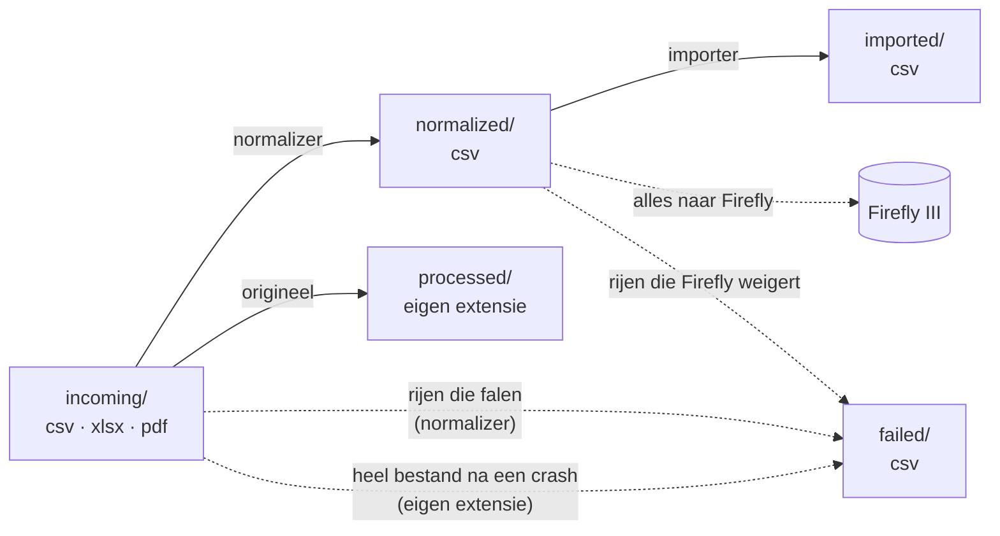

# Plan 02 — Argenta

Status: **goedgekeurd; uit te voeren na [plan 01](01-kern-fintro-firefly.md)**, dat de
bestandsnamen, `interest_date`, vreemde munt, het opzoeken van eigen rekeningen en het
rekeningbestand levert. Voorbeelden zijn verzonnen (publieke repo); echte rijen blijven in de
terminal.

Harde eis bij elke stap: **een idle run blijft gratis** (AGENTS.md "Idle cost").

## 0. Wat er binnenkomt

| Bron | Formaat | Rijen nu | Bijzonder |
|---|---|---|---|
| Zichtrekening | `.xlsx`, 1 blad `Verrichtingen`, 11 kolommen | 250 | 16 soorten `Beschrijving` |
| Spaarrekening | zelfde `.xlsx`-formaat | 61 | interest met eigen IBAN als tegenpartij |
| Mastercard | maandelijks **PDF-afschrift**, 110 stuks | ± 430 lijnen (ruwe telling) | geen referentie per lijn, geen jaartal per lijn |

Kolommen xlsx: `Rekening, Boekdatum, Valutadatum, Referentie, Beschrijving, Bedrag, Munt,
Verrichtingsdatum, Rekening tegenpartij, Naam tegenpartij, Mededeling`.

Vastgesteld in de data:

1. **Datums zijn Excel-getallen** (`45000` = 2023-03-15), bedragen **floats** (`-12.5`, `3.1`; verzonnen).
2. **`Referentie` is niet uniek**: een afgelopen termijndeposito geeft twee rijen met dezelfde
   referentie (kapitaal terug + interest). Verder uniek binnen een rekening; een overschrijving
   tussen de twee Argenta-rekeningen draagt aan beide kanten dezelfde referentie.
3. `Referentie` codeert de boekdatum: `C6I30…` = 202**6**, maand **I** (A=jan … L=dec), dag **30**.
   Klopt voor alle 311 rijen.
4. Kaartbetalingen/-opnames (Maestro, Bancontact buitenland) hebben als tegenpartij-IBAN de
   **dummy `BE54 0000 0000 0000`** — met geldige checksum (nagerekend), dus Firefly zou ze
   aanvaarden en alle winkels op één tegenrekening zetten.
5. Interest (`Taks Portkost Interest`) heeft de **eigen rekening** als tegenpartij-IBAN.
6. Termijndeposito: in `Rekening tegenpartij` staat het **depositonummer**, geen IBAN.
7. Kaartafrekening `Debet ten voordele van BCC` (zicht → Mastercard): naam `MASTERCARD  247`;
   247 = dagnummer van de afschriftdatum (4 september; in schrikkeljaar 248). Enkele oude rijen:
   naam leeg.
8. Mededeling van kaartbetalingen bevat datum+uur, winkel/plaats, land en kaartnummer, in twee
   lay-outs (oud: `MUNT NAAM dd-mm-jj uu:mm`, munt kan een vreemde munt zijn; nieuw:
   `[WINKEL ]dd-mm-jjjj uu:mm PLAATS[ LAND] KAARTNR`).
9. PDF's: allemaal één generator (Macro 4 Columbus), Flate-gecomprimeerd, WinAnsi-fonts, elke
   tekst met absolute x/y. Met stdlib leesbaar. **5 lay-outgeneraties.** `pdftotext -layout`
   zet in oudere generaties bedragen naast de verkeerde regel → niet bruikbaar, coördinaten wel.
10. PDF-lijnen: `dd/mm` transactie + `dd/mm` verrekening, omschrijving, bedrag `12,34-`/`+`
    (oud: `12,34 -`), vreemde munt als `10,80-USD` + volgende regel `1 EUR=1,0800000 USD` (verzonnen).
    Twee identieke lijnen op één afschrift komen voor (zelfde dag, winkel, bedrag).
11. Ontbrekende maanden in de PDF-map vallen samen met maanden zonder BCC-debet op de
    zichtrekening (steekproef): geen activiteit → geen afschrift.
12. Fintro-exports bevatten tientallen rijen naar/van de Argenta-rekeningen; die staan nu in
    Firefly als uitgave/inkomst, niet als overschrijving tussen eigen rekeningen.
13. Server: Python 3.11, PyYAML, **geen** PDF- of xlsx-bibliotheek en geen `pdftotext`.

## 1. Beslissingen

1. ✅ **Mastercard als eigen Firefly-rekening** (kind `credit_card`), elke aankoop apart.
2. ✅ **De zichtrekening betaalt de kaart af.** Het PDF noemt die IBAN niet en elk bestand wordt
   apart verwerkt, dus het programma moet hem krijgen: `ARGENTA_MASTERCARD_PAID_FROM_IBAN` in
   het server-only `config/app.env` (niet in git). Zonder die waarde faalt de afbetalingslijn.
3. ✅ **Kaartrekening in het rekeningbestand** (plan 01 stap 5): IBAN = het BCC-inningsnummer
   uit de zicht-export (zodat `Debet ten voordele van BCC` een overschrijving wordt),
   rekeningnummer = klantenreferentie van het afschrift.
4. ✅ **Termijndeposito** (afgelopen): eigen afgesloten rekening (kind `savings`),
   depositonummer als rekeningnummer → start en terugbetaling zijn overschrijvingen, de
   interest een inkomst van Argenta.
5. ✅ **Datums**: zie §2 "Vier namen per gegeven". Kaart-PDF: verrekeningsdatum → hoofddatum,
   want de afbetaling staat op het afschrift met als transactiedatum de afschriftdatum (de 4e) en
   als verrekeningsdatum de dag van het debet (rond de 14e), en de zichtrekening boekt die 14e;
   met de 4e vallen de twee kanten buiten de ±7 dagen en komt de overschrijving er twee keer in.
6. ✅ **`MASTERCARD 247`** → tegenpartijnaam `Argenta Mastercard` (er kan ooit een tweede
   Mastercard komen), notitie `Kaartafschrift van 2026-09-04` (247 = dagnummer van de afschriftdatum).
7. ✅ **Begin kaarthistoriek**: de oudste afschriften ontbreken, terwijl de zichtrekening ze al
   afbetaalt. Beginsaldo van de kaartrekening zo berekend dat het saldo vanaf het eerste
   afschrift klopt; de aankopen van daarvóór ontbreken als losse lijnen.
   ⏰ **Herinneren**: de gebruiker probeert de oudere afschriften nog bij Argenta te krijgen;
   vragen vóór de herlaadbeurt (§4). Komen ze, dan vervallen dit beginsaldo en deze beperking.
8. ✅ **`Referentie`-datumcheck** (punt 0.3): rij faalt als code en boekdatum verschillen.
9. ✅ **Vreemde munt** (mechanisme: plan 01):
   - Kaart-PDF: `10,80-USD` + `1 EUR=1,0800000 USD` → 10,80 ÷ 1,08 = 10,00 = EUR-bedrag
     (verzonnen), anders faalt de lijn.
   - Argenta-xlsx, oude lay-out: alleen de munt, geen bedrag → enkel notitie; Firefly
     aanvaardt geen vreemde munt zonder bedrag.
10. ✅ **De bestandsnaam van het origineel speelt nergens een rol**: xlsx en pdf worden op
    inhoud herkend (kolomkop, afschrifttekst), net als CSV nu. De twee niet-afschriften in
    `Mastercard/` zet de gebruiker buiten `bank-csv-originals/`.

## 2. Gegevensstroom en inlezen

Mappen blijven wat ze zijn; alleen `incoming/`, `processed/` en (na een crash) `failed/`
krijgen ook `.xlsx`/`.pdf`. Namen: plan 01 stap 1.



Geen `converted/`-tussenstap: de normalizer leest een xlsx/pdf in het geheugen tot dezelfde rijen
die hij nu uit een CSV leest (zoals een CSV nu ook niet eerst "geconverteerd" wordt). Eén stap
minder die kan falen, half kan blijven staan of een eigen alert nodig heeft. Om de gelezen tabel
te zien: `debug_row` op het originele bestand.

Waar het inlezen woont:

| Wat | Bankspecifiek? | Waar |
|---|---|---|
| xlsx → tabel (kop + rijen) | nee: elk xlsx-bestand is zo opgebouwd | `engine/core/xlsx_reader.py` |
| PDF → losse tekststukken met pagina en x/y | nee: alleen het PDF-formaat | `engine/core/pdf_text.py` |
| tekststukken → transactierijen (welke regel is een aankoop, welk bedrag hoort erbij, saldocontrole) | **ja**: de lay-out van Argenta's kaartafschrift | `engine/banks/argenta_mastercard/statement.py` |
| rij → genormaliseerde rij | ja | `engine/banks/<bank>/normalize.py`, zoals Fintro |

De yaml van de bank zegt welke lezer bij haar PDF's hoort, dus `engine/core/` kent geen banknamen.

Geen extra tools op TrueNAS: alles met de Python-standaardbibliotheek (nagekeken: Python 3.11).
xlsx = zip met XML-bestanden → `zipfile` + `xml.etree`; Argenta-PDF = zlib-gecomprimeerde tekst
met x/y-positie per stuk → `zlib` + `re`. Op de server zelf getest (alleen lezen) op een
spaar-xlsx en het oudste afschrift. Wijzigt Argenta ooit de PDF-generator, dan weigert de
lezer het bestand met een alert; pas dan is een container of bibliotheek het overwegen waard.

Vier namen per gegeven, van bank tot Firefly:

| Argenta xlsx | Intern (yaml) | Normalized CSV | Firefly API |
|---|---|---|---|
| Referentie | `external_id` | `external_id` | `external_id` |
| Boekdatum | `primary_transaction_date` | `primary_transaction_date` | `date` |
| Valutadatum | `interest_date` | `interest_date` | `interest_date` |
| Verrichtingsdatum | `transaction_processing_date` | `transaction_processing_date` | `process_date` |
| — (datum+uur uit Mededeling) | — | `payment_date` | `payment_date` |
| Bedrag | `amount` | `amount` | `amount` zonder teken; teken → `type` |
| Munt | `account_currency_code` | `account_currency_code` | `currency_code` |
| Rekening | `asset_account_iban` | `asset_account_iban` | `source_id`/`destination_id` (eigen rekening opgezocht op IBAN of rekeningnummer) |
| — (kaart-PDF: klantenreferentie) | — | `asset_account_number` | idem |
| Rekening tegenpartij | `opposing_account_iban` | `opposing_account_iban`, of `opposing_account_number` (depositonummer), of leeg (dummy/eigen IBAN) | `destination_iban`/`source_iban` (`_number`), of overschrijving |
| Naam tegenpartij | `opposing_account_name` | `opposing_account_name` (+ plaats uit Mededeling) | `destination_name`/`source_name` |
| Beschrijving | `transaction_type` | `unmapped_transaction_type` + regel in `notes` | via `notes` |
| Mededeling | `description` | `description` (kaartrijen: ontleed, zie stap 3) | `description` |
| — | — | `opposing_account_bic` (leeg: Argenta geeft geen BIC) | `destination_bic`/`source_bic` |
| — | — | `is_cash_withdrawal` | Firefly's Cash-rekening |
| — (kaart-PDF: origineel bedrag + munt) | — | `foreign_amount`, `foreign_currency_code` | `foreign_amount`, `foreign_currency_code` |
| — | — | `notes` | `notes` |
| — | — | `unmapped_*` (kopie van notitiedelen) | niet verstuurd |

"Intern" = de naam na het inlezen, waarmee validatie, duplicaatindex en `normalize_row` werken.
"Normalized" = de vaste kolommen van `NORMALIZED_FIELDNAMES`, voor elke bank dezelfde.
De Firefly-namen verschillen daarvan; de vertaling gebeurt alleen in `build_split()`.

## 3. Stappen (volgorde = commits)

Elke stap: `pre-commit`, regressietest. Op Fintro: nul verschillen; de Argenta-bestanden
verschijnen als "nieuw in deze versie".

### Stap 1 — xlsx en pdf aannemen

1. `firefly-iii-feeder.bash`:
   - `incoming/*.csv` → `*.csv *.xlsx *.pdf` (ook in de idle-check; globs zijn builtins).
   - Uploadcontrole: "laatste byte is een newline" geldt alleen voor CSV; een xlsx (zip) of PDF
     eindigt nooit zo, dus met die check alleen zou elk bestand 10 min wachten zonder
     bescherming. Nieuw: xlsx compleet = zip-eindrecord (`PK\x05\x06`) in de laatste 64 KB;
     PDF compleet = `%%EOF` in de laatste 1 KB. Met `tail -c`, alleen als er een bestand is.
   - Idle-meting herhalen, ≤ 2 ms.
2. `load_csv_rows` → `load_rows(path, bank_configs)`, kiest op extensie:
   - `.csv`: ongewijzigd.
   - `.xlsx`: nieuw `engine/core/xlsx_reader.py`, stdlib. Eerste blad, rij 1 = kop. Cel met
     datumformaat → `YYYY-MM-DD`; ander getal → de tekst zoals opgeslagen; lege cel → `""`.
     Weigert met duidelijke fout: meerdere bladen met data, formules zonder waarde, onbekend celtype.
   - `.pdf`: tabel komt van een bank-specifieke lezer, aangeduid in de yaml (`reader:`). Elke
     lezer zegt "niet van mij" of geeft rijen met eigen kolomnamen; daarna werkt
     `autodetect_bank` op de kop zoals nu.
   - `_source_line` = Excel-rijnummer (kop = 1, zoals CSV) of `p<pagina>/<lijn>` voor PDF.
3. `engine/regression.py` leest via `load_rows`; een bestand dat de oude versie niet kan lezen
   (nog geen Argenta-config) breekt de test nu af en telt voortaan als "nieuw in deze versie",
   met het aantal rijen ok/gefaald.

### Stap 2 — Gedeelde helpers

`parse_iban`, `extract_structured_ref`, `normalize_for_comparison`, `apply_replacements`,
`parse_comma_decimal_amount` verhuizen van `engine/banks/fintro/parsers.py` naar
`engine/core/parsers.py`; Fintro importeert ze daar. Geen gedragswijziging. Nu pas, omdat
Argenta de tweede gebruiker is: dan is duidelijk welke vorm de gedeelde versie nodig heeft.

### Stap 3 — Argenta-rekeningen (`config/argenta.yaml`, `engine/banks/argenta/`)

Eén config voor zicht- én spaarrekening (zelfde kolommen).

| Kolom | Intern | Validatie |
|---|---|---|
| Referentie | `external_id` | `^[A-Z][0-9][A-L][0-9]{2}[A-Z0-9]{11}$` |
| Boekdatum / Valutadatum / Verrichtingsdatum | zie §2 | ISO-datum |
| Rekening | `asset_account_iban` | IBAN (spaties toegestaan) |
| Beschrijving | `transaction_type` | niet leeg |
| Bedrag | `amount` | `^-?[0-9]+(\.[0-9]+)?$`; exact via `Decimal`, max 2 decimalen, → `-2.00` |
| Munt | `account_currency_code` | `EUR`, anders rij faalt (zoals Fintro) |
| Rekening tegenpartij, Naam tegenpartij, Mededeling | optioneel per type | — |

`duplicate_key`: `Referentie|Bedrag` (punt 0.2; het bedrag verandert nooit, een
omschrijving kan Argenta herformuleren). `partition_by: asset_account_iban`.

**Elke `Beschrijving` heeft een eigen regel; een onbekende laat de rij falen.** Types krijgen
Fintro's woordenschat, zodat de latere classificatie over beide banken gelijk filtert.
"Inkomende/Uitgaande" valt expliciet weg: de richting zit in het teken.

| Beschrijving (Argenta) | Tegenpartij | Omschrijving / notities |
|---|---|---|
| Inkomende/Uitgaande (instant)overschrijving | IBAN + naam uit kolommen | Mededeling (gestructureerd → `+++…+++`); type `Overschrijving` / `Instantoverschrijving` |
| Betaling Maestro, Betaling België, Betaling bancontact in het buitenl., Opname Maestro, Opname bancontact in het buitenland | dummy-IBAN **expliciet weg**; naam = winkel + plaats + land | Mededeling ontleed (zie onder); opname → `is_cash_withdrawal=1` |
| Debet ten voordele van BCC | BCC-IBAN (→ overschrijving naar kaart, §1.3) | §1.6 |
| Storting kredietkaart | BCC-IBAN (→ overschrijving vanaf kaart) | referentie uit Mededeling |
| Kredietkaart Green-pakket | `Argenta` (bankkost, zoals `Fintro`) | Mededeling |
| Taks Portkost Interest | **eigen IBAN expliciet weg** → `Argenta` | type als notitie |
| Start van een termijndeposito / Vereffening van termijnplaatsing | depositonummer → `opposing_account_number` | §1.4 |
| Vereffening van een termijndeposito (interest) | `Argenta`; depositonummer + code (`MMELIQ`, betekenis onbekend → blijft) in notities | — |

Mededeling van kaartrijen (verzonnen voorbeelden), twee bronnen vergeleken zoals bij Fintro:

```
Naam tegenpartij: ACME MARKT
Mededeling:       ACME MARKT 17-06-2023 11:00 GLASGOW GB 123456*******7890
→ naam  ACME MARKT GLASGOW GB      payment_date  2023-06-17 11:00
→ notes Betaling met Maestro-debetkaart 123456*******7890

Naam tegenpartij: SAINT-VAAST
Mededeling:       USD SAINT-VAAST        08-05-17 13:01
→ naam  SAINT-VAAST                payment_date  2017-05-08 13:01
→ notes Buitenlandse geldopneming met Bancontact; Munt: USD
```

- Naamkolom moet in de Mededeling voorkomen, anders faalt de rij (zelfde regel als
  `merge_opposing_account_name`). Tekst vóór de datum die niet de naam is (bv. de bank van de
  automaat, `B B V A`) gaat mee in de naam, niet weg.
- Herhaalde spaties in namen (`AB         C`) worden één spatie: opmaak, geen informatie.
- Een munt `EUR` voor de naam herhaalt de rekeningmunt → expliciet weg; elke andere munt blijft.

### Stap 4 — Mastercard-afschriften (`config/argenta_mastercard.yaml`, `engine/banks/argenta_mastercard/`)

1. `engine/core/pdf_text.py` (stdlib): Flate-streams → tekststukken met pagina, x, y, font,
   tekst (WinAnsi = cp1252, PDF-escapes). Weigert alles daarbuiten (versleuteld, ToUnicode,
   objectstreams, andere filters) → wijzigt Argenta van generator, dan faalt het bestand
   luid in plaats van half te lezen.
2. Afschriftlezer: regels op y, kolommen op x. Kop: afschriftdatum (oudere generaties
   `dd/mm/jj`, nieuwere `dd/mm/jjjj`), periode `van … tot …`, klantenreferentie (→
   `asset_account_number`), per kaart `Kaartnummer`.
   **Jaartal van elke `dd/mm`** uit de periode (dec→jan-afschrift loopt over de jaargrens),
   niet uit "dichtstbijzijnde datum".
3. Soorten lijnen: `Vorig saldo` (controle, geen transactie), afbetaling
   (`DOMICILIERING VIA UW BANK` / `Domiciliëring bij uw bank`, `+`) → overschrijving vanaf de
   rekening uit §1.2, aankopen/terugbetalingen, vreemde munt + koers, `Subtotaal` en
   `Nieuw saldo` (controle). Onbekende lijn → afschrift faalt.
4. **Controles (de Fintro-aanpak van twee bronnen):**
   - per afschrift: vorig saldo + afbetaling + alle lijnen = nieuw saldo, elk bedrag met het
     teken van het afschrift (verzonnen: `100,00-` + `100,00+` + `42,50-` = `42,50-`), en per
     kaart subtotaal = som van zijn lijnen. Klopt het niet → het hele afschrift faalt (een
     verkeerd gelezen bedrag of gemiste lijn kan zo niet door).
   - over bronnen heen (los script op de desktop, zoals de regressietest): nieuw saldo van
     afschrift N = BCC-debet op de zichtrekening de maand erna. Vangt ook ontbrekende afschriften.
5. Rijen: `Klantenreferentie, Afschriftdatum, Volgnummer, Datum transactie, Datum verrekening,
   Omschrijving, Bedrag, Munt, Origineel bedrag, Originele munt, Koers, Kaartnummer`.
   `duplicate_key` = afschriftdatum + volgnummer (`2018-12-04/03`, verzonnen): een afschrift
   verandert nooit, en twee identieke lijnen krijgen zo elk een eigen sleutel.
   `partition_by` = klantenreferentie. Periode in de bestandsnaam = periode van het afschrift.
6. Alle 110 afschriften moeten slagen, per generatie nagekeken.

### Stap 5 — Documentatie

AGENTS.md, README, architectural_patterns.md: `data/incoming/` aanvaardt csv, xlsx, pdf;
lezers voor niet-CSV in "Adding a New Bank"; Argenta-regels en gotchas (dummy-IBAN,
niet-unieke referentie, eigen IBAN bij interest, BCC-afrekening);
`ARGENTA_MASTERCARD_PAID_FROM_IBAN` in `app.env`; regressie- en herlaadcommando's
(`Fintro/`, `Argenta/`, `Argenta/Mastercard/<jaar>/`; xlsx, pdf).

## 4. Volledige herlaadbeurt (jij, op de server)

Nodig omdat de Fintro-rijen naar Argenta en Rabobank (punt 0.12, plan 01 §1.8) nu
uitgaven/inkomsten zijn: zonder herladen komt er bij de Argenta-import een overschrijving bij
→ **dubbel geteld**. Eén keer, na beide plannen; ze geeft ook bestaande transacties de
wijzigingen van plan 01.

1. Wachten tot `data/incoming/` en `data/normalized/` leeg zijn.
2. Firefly wissen volgens AGENTS.md "Start Over" (wist ook de uitgave-/inkomstrekeningen met
   Argenta- en Rabobank-IBAN's).
3. Rekeningbestand (plan 01 stap 5) aanvullen en toepassen: Argenta-zicht en -spaar,
   Argenta Mastercard (§1.3; beginsaldo uit §1.7), termijndeposito (§1.4), de Rabobank-rekeningen
   met hun correctieboeking (plan 01 §1.8). De xlsx-exports hebben geen saldokolom: het
   Argenta-beginsaldo komt uit de Argenta-app of een rekeninguittreksel.
   ⏰ Eerst §1.7 navragen (oudere kaartafschriften).
4. `ARGENTA_MASTERCARD_PAID_FROM_IBAN` in `config/app.env` (§1.2).
5. `data/` leegmaken en alle originelen terugzetten: `Fintro/`, `Argenta/` en
   `Argenta/Mastercard/<jaar>/` (commando uit stap 5).
6. Controle: Firefly-saldo van elke Argenta-rekening = saldo in de Argenta-app vandaag;
   kaartsaldo = laatste `Nieuw saldo`; beide Rabobank-rekeningen eindigen op 0; elke eigen
   overschrijving staat er precies één keer.

Duurt ongeveer een uur (~14.500 Fintro-rijen in batch + ~750 Argenta-rijen).

## 5. Testen

1. Regressietest na elke stap: Fintro nul verschillen; Argenta "nieuw in deze versie".
2. Argenta: alle 311 xlsx-rijen en alle afschriftlijnen normaliseren zonder fout, of de fout
   is verklaard en de parser aangepast.
3. Server: één xlsx en één PDF via `data/incoming/`, controleren in `data/normalized/`,
   `data/failed/`, `data/logs/`; importer met `--dry-run`.
4. Voor elke commit: staged diff scannen op IBAN-vormige strings en echte namen (publieke repo).

## 6. Later

- Originelen in `bank-csv-originals/` consequent hernoemen (de feeder heeft geen naam nodig, §1.10).
