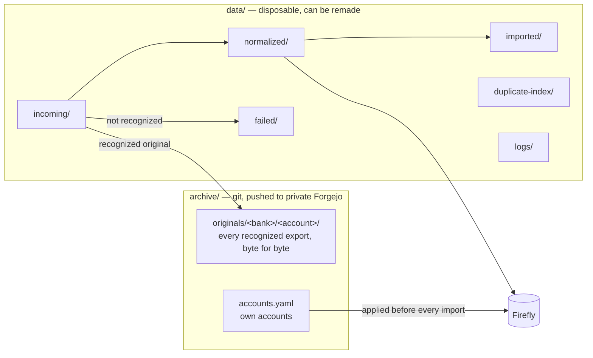
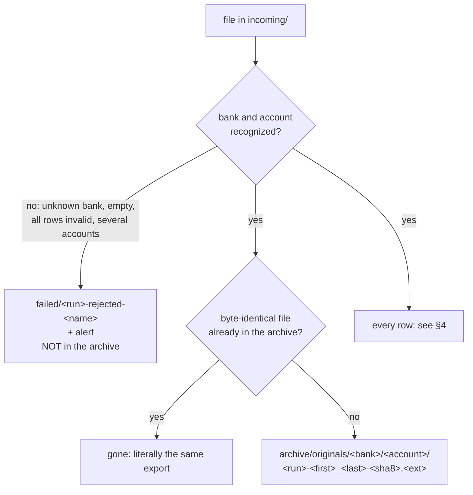
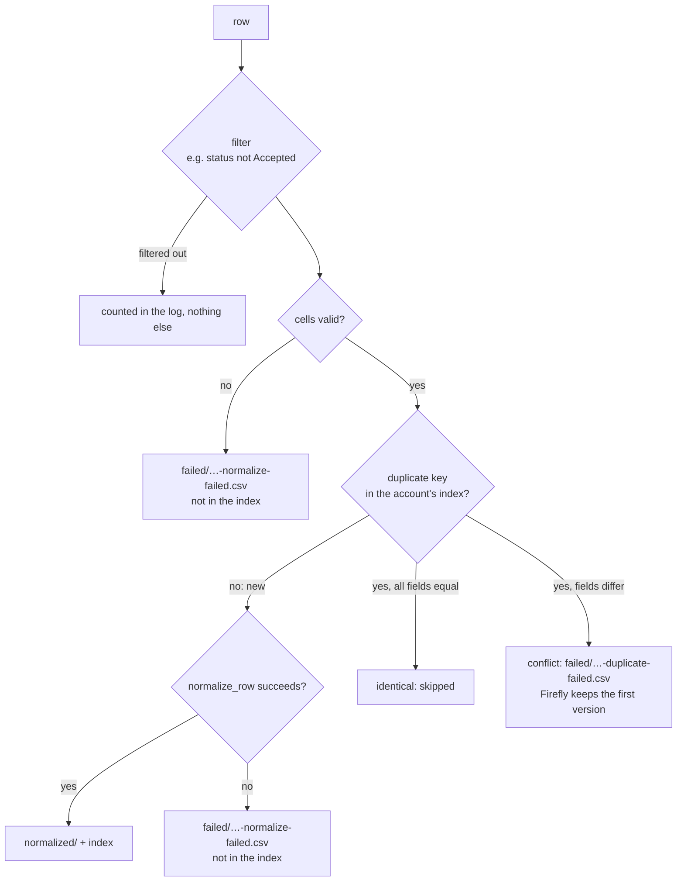
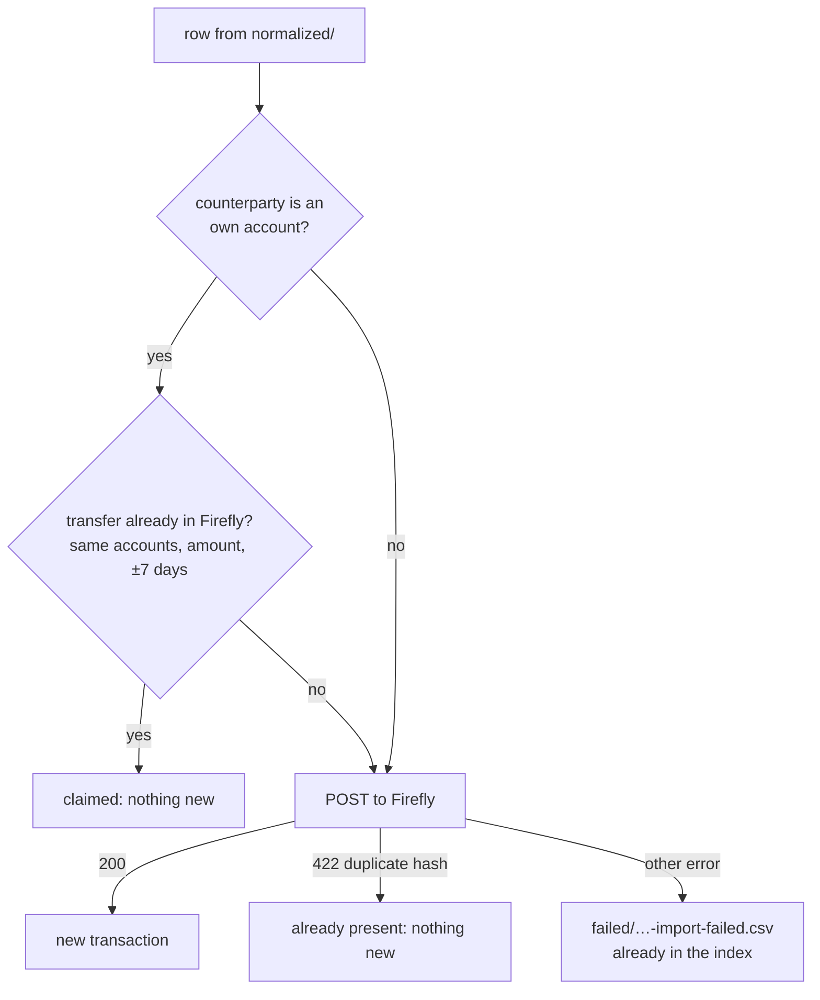
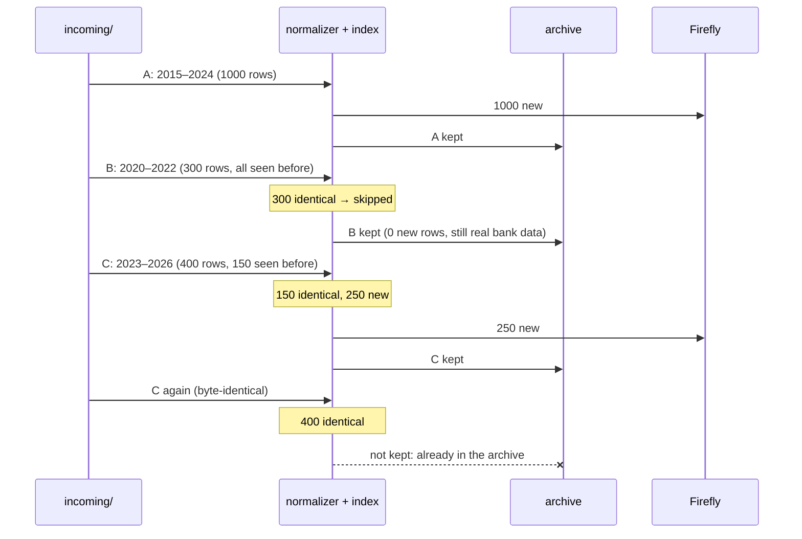
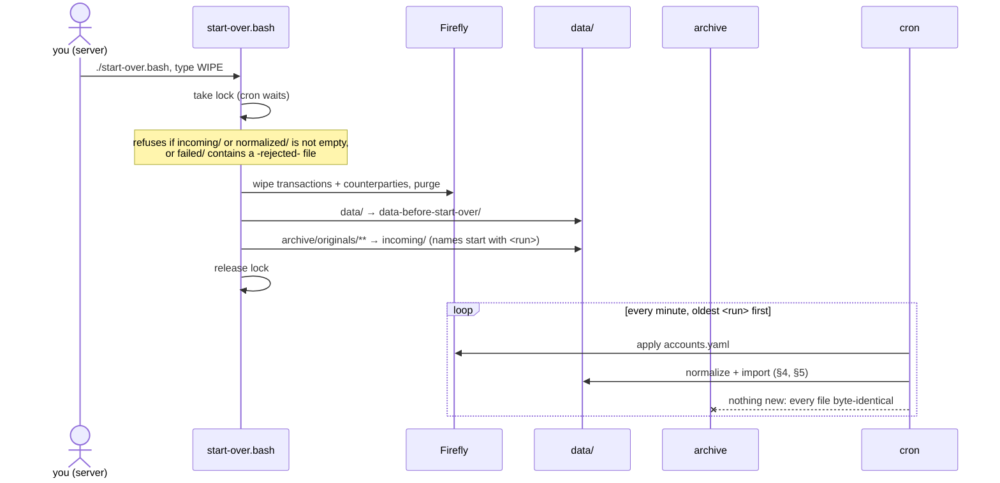
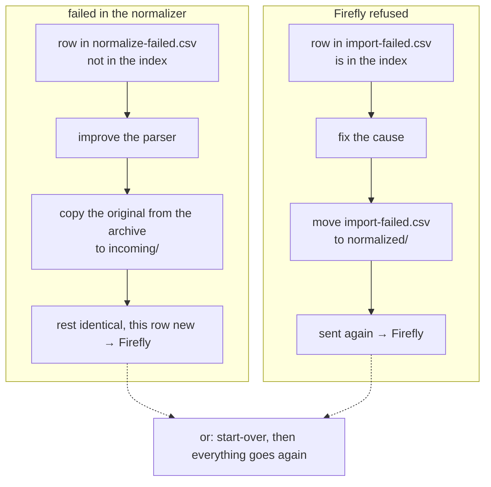
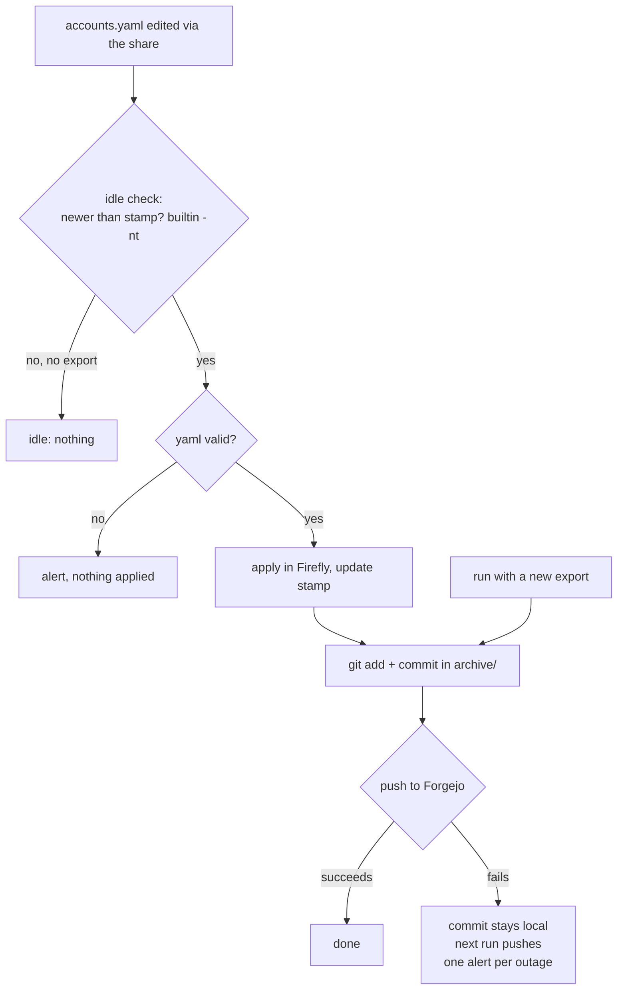

# Plan 03 — Archive and starting over

Status: **draft, for discussion.** Examples are made up (public repo).

Goal: you drop an export in `data/incoming/` and need to do nothing else. Everything needed to
fill Firefly again from zero comes under version control in private Forgejo by itself, and
starting over is one command.

## 1. Requirement (becomes a hard rule in AGENTS.md)

> Firefly is derived from the input. Wiping it and loading everything again must always be
> possible, with one command, and gives the result of the current code. After every structural
> change to the feeder or to Firefly that is the normal way to give old transactions the new
> shape.

1. All input is in the archive repo; `data/` and Firefly contain nothing that cannot be remade.
2. Fix nothing by hand in `data/` or Firefly: a fix goes into the parser, config or accounts
   file. Classification: the finance tool, which must also be able to reapply it.
3. Plans and reviews do not warn "then you have to wipe Firefly": that is the intention.

## 2. What stays, what is disposable

`processed/` disappears: a recognized original goes to the archive, an unrecognized one to
`failed/`.

## 3. One file: where the original goes

- What happens to the rows does not matter for the archive: an export with only duplicates, or
  of which all rows fail in the parser, is real bank data and goes in.
- `<run>` at the front = order of arrival; on a reload the files go back in that order (§7).
  `<sha8>` = start of the SHA-256 of the content; "byte-identical" is tested on it.
- A rejected file may be real bank data (the bank changed its export format). After the fix you
  put it back in `incoming/`; until then `start-over.bash` (§7) refuses, so it does not vanish
  with `data/`.

## 4. One row in the normalizer

Unchanged compared to now.

A row only enters the index once it is normalized. A row that failed is therefore retried as
soon as the same export arrives again (§8).

## 5. One row in the importer

Unchanged compared to now.

## 6. Overlapping exports

Made up: three exports of one account, arrived in this order.

Firefly: 1250 transactions. The archive: A, B and C; the rows in the overlap are thus in the
archive more than once, and that is the intention: the archive keeps what the bank gave, the
index deduplicates on every (re)load.

## 7. Starting over

Same order as the first time, so the same outcome, also on a conflict (§4: the first version
wins). The token and the one-off setup (checklist, plan 01 step 6) stay outside the reload.

## 8. A row that failed, again

## 9. Accounts file and git

## 10. Open

- Forgejo is not yet in the replication to truenas-backup (todo in sync-truenas-servers): until
  then the archive and Forgejo are on one machine, with the snapshots of `app-ds`.
- Deploy key + ssh config in the cron user's second home directory (`homedir-ds`, survives a
  TrueNAS update); the archive repo points to it with `core.sshCommand`.
- Transition: the reload of plan 02 §4 becomes the first start-over, once with
  `bank-csv-originals/` as source; after that that folder can go.
- A conflict (§4) returns on every reload. How to resolve it (which version wins) is not written
  down anywhere yet.
